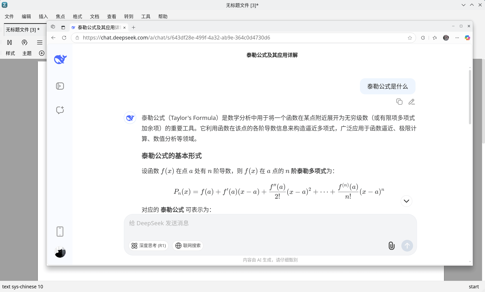
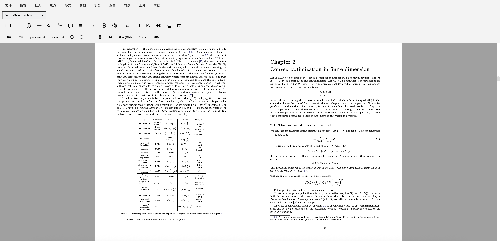

# Mogan STEM

Mogan STEM is a professional scientific writing platform targeted at mathematics, physics, statistics, and computer science, specially designed to handle complex formula-based documents. It is deeply optimized from [GNU TeXmacs](https://www.texmacs.org/), with emphasis on performance and user experience. With Mogan STEM you can create scientific documents up to 100x faster than with $\LaTeX$.

**Visit the official websites:**
- **Mogan STEM (Community Version)**: [https://mogan.app](https://mogan.app)
- **Liii STEM (Commercial Version, with built-in AI)**: [https://liiistem.com](https://liiistem.com)

## Key Features

### 📋 Magic Paste
- Supports mainstream AI models such as ChatGPT, Claude, and Gemini
- Automatically recognizes mathematical formulas, code blocks, tables, and other complex formats
- One-click conversion to the standard TeXmacs format with no manual adjustment required
- Preserves original formatting and style integrity



### 🛠 Export PDF & LaTeX
- Batch export in multiple formats to suit different scenarios
- PDF export: preserves original document layout and supports high-resolution printing
- LaTeX export: improves compilation success rate and is compatible with mainstream journal submission requirements


### ⚡ Fast Math Editing
- Independent math mode: quick switching and focused formula editing
- Smart shortcuts: Lego-like memory rules and Tab-key cycling to reduce mouse operations
- Rich symbol library: covers a complete set of mathematical and physical symbols with numerous key combinations


### 🎓 Easy to learn, capable of thesis-level editing
- Three primary modes switch seamlessly; easy to operate and quick to get started
- Clear structure for different content types and well-organized document hierarchy
- Click to insert environments; complex typesetting becomes simple



### Scientific Document Creation
- High-quality typesetting: professional document formatting with TeX quality output
- Mathematical notation: advanced formula editing with LaTeX compatibility
- Bibliography management: built-in reference and citation tools

### Performance & Usability
- Faster startup: optimized performance compared to TeXmacs
- Responsive interface: modern Qt6-based user interface
- Cross-platform: available for Windows, macOS, and Linux

### Integration with other scientific tools
- Plugin system: extensible via multiple programming languages (Python, C++, Scheme) and tools
- Document formats: supports TeXmacs, LaTeX, PDF, HTML, and more
- Interactive plotting: integration with data analysis tools for interactive plots

## Quick Start

### Installation

#### Mogan STEM (Community Version)
From Release: Download the latest release for your platform from [GitHub releases](https://github.com/XmacsLabs/mogan/releases).

Build from Source:
```bash
# Clone the repository
git clone https://github.com/XmacsLabs/mogan.git
cd mogan

# Build with xmake
xmake build stem
```

#### Liii STEM (Commercial Version)
For the commercial version with built-in AI features, please visit the [Liii STEM official website](https://liiistem.cn) for installation options.

## Documentation & Learning

### Community Version Resources
- Mogan website: [https://mogan.app](https://mogan.app)
- GitHub repository: [github.com/XmacsLabs/mogan](https://github.com/XmacsLabs/mogan)
- User manual: comprehensive guide covering all features ([Liii/Mogan STEM docs](https://liiistem.cn/docs/welcome.html))
- Video tutorials: step-by-step learning materials

### Commercial Version Resources
- Liii STEM website: [https://liiistem.cn](https://liiistem.cn)
- Private services: commercial guides and custom services ([pricing & services](https://liiistem.cn/pricing-fruit.html))
- AI features: documentation for built-in AI-assisted formatting and proofs ([AI guide](https://liiistem.cn/docs/guide-tuto-llm-plug.html))

### 🌍 Language Support
- Chinese: full Chinese interface and documentation
- English: complete English documentation for international users
- Multilingual: community translations available

## Community & Development

### Mogan Community
- Contributing documentation: contributions welcome (see Liii/Mogan STEM docs)
- Core development, plugins, translations, and community-driven testing and documentation

### 🔗 Contact
- Mogan Discord Channel: https://discord.com/invite/M5Gg8yAsTx
- Community lead email: yansong@liii.pro
- Liii STEM: contact via the [official website](https://liiistem.cn)


