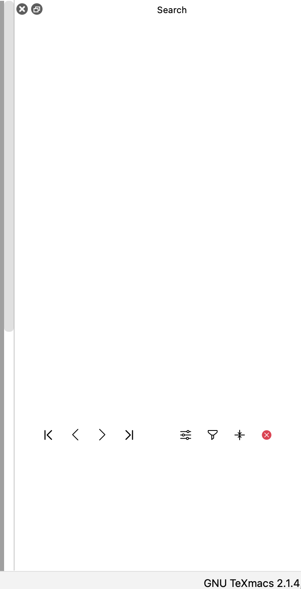
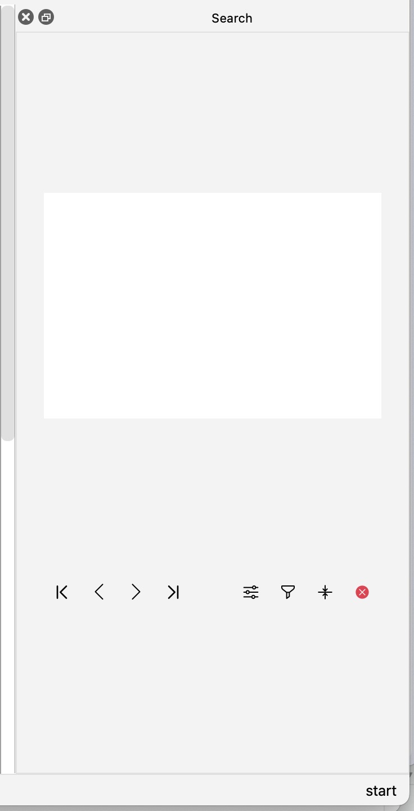

# 201_9 辅助组件
## 如何测试？
### 测试辅助窗口中的宏编辑
1. 插入宏，例如`\strong`
2. cmd-opt-e 打开宏编辑去（或者点击工具栏-扳手-edit macro）
3. 检查：宏编辑器打开在右侧辅助窗口中
4. 检查：宏编辑器的功能如初

### 测试辅助窗口组件和接口
1. 拆入一个Scheme会话
2. 定义一个Widget，例如一个显示 Hello world 的text_widget
```
(define hw-widget (widget-text "Hello world from QTMAuxiliaryWidget" 0 (color "blue") #t))
```
3. 设定辅助窗口
```
(set-auxiliary-widget hw-widget "Hello World Widget")
```
4. 展示辅助窗口
```
(show-auxiliary-widget #t)
```

## 实现并暴露 switch-to-parent-window 函数
### What
- 在 tm_window 中添加了 public 成员变量 url parent，用于记录父窗口
- 修改了创建 texmacs_input_widget 时构造 tm_window 的参数，添加父窗口
- 在 new_window.cpp 中实现了 switch_to_parent_window 函数
- 暴露了 switch_to_parent_window 为 switch-to-parent-window

### Why
将来进一步优化多缓冲区的编辑，尤其是“辅助窗口自动切换回父窗口编辑区”的操作，需要此函数。

### 关于测试
目前没有简单的方法测试，如果想要测试需要构造一些比较复杂的 Scheme 语句，然后在运行时中运行。为了简便目前不添加测试了。

将来的 PR 中会调用此函数，也就相当于测试了。


## 2025/07/29 将结构化替换放到辅助组件中
顺带调整了一下搜索输入区域的宽度使之与替换的输入区域统一，这部分修改太小了就不另外提PR了。

## 2025/07/23 修改辅助窗口的css样式表
### before


### after


## 2025/07/23 将结构化搜索放到辅助组件中

## 2025/07/23 将宏编辑放到辅助组件中
## 2025/07/23 添加设置组件标题的接口
### What
- 在`qt_tm_widget_rep::send`中添加了`SLOT_AUXILIARY_WIDGET`的case，用于处理辅助组件标题的设置
- 修改了`set-auxiliary-widget`的参数，添加了一个必须的参数`string name`作为辅助组件的标题
- 修改了宏编辑窗口的创建过程，使宏编辑窗口创建在辅助组件中


## 2025/07/21 初步实现辅助窗口组件和接口
### What?
初步实现了辅助窗口组件`QTMAuxiliaryWidget.cpp`，并提供了scheme接口`show-auxiliary-widget`和`set-auxiliary-widget`。

窗口是可以变成浮动窗口，并且拖拽的，但具体的细节（例如最小尺寸、位置限制）还没有实现。
