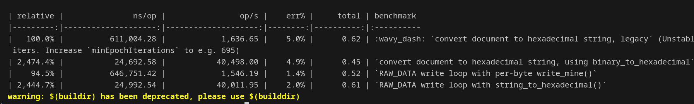

# 207_1 as_hexadecimal的优化问题

## 2025/07/21 优化 `totm.cpp`中 `tm_writer::write(tree t)` RAW\_DATA 分支逻辑

### What

1. **提取核心逻辑**

   将 `tm_writer::write()` 相关的核心实现（`write_space / flush / cr / write_mine` 及状态变量）**全部复制到 `numeral_bench.cpp`**，保证 benchmark 在脱离原工程的情况下仍可 1 : 1 复现输出语义。

2. **思考优化方案**

   将逐字节
   `for (i = 0; i < N(s); ++i) write(as_hexadecimal(s[i], 2), false);`
   改写为一次性
   `write(binary_to_hexadecimal(s), false);`
   即 **使用 `binary_to_hexadecimal()` 整体转换**，消除 O(N) 次 `as_hexadecimal` 构造与 `write()` 调用。

3. **实现 self-check**
   在 benchmark 启动前编写 `self_check()`：

   * 跑一遍旧循环生成 `hex1`
   * 跑一次整体转换生成 `hex2`
   * 断言 `hex1 == hex2`，确保功能等价。

4. **修改原源码**

   在 `RAW_DATA:` 分支里直接 `write(binary_to_hexadecimal(s), false);`，其余逻辑保持不变。

### Why

* 原逐字节方案 **每字符 1 次临时 `string` 构造 + 1 次 `write()` 调用**，函数栈开销和缓冲扩容极大。
* nanobench 数据显示（LICENSE 400 KiB）：



优化后的性能约为之前的25倍。

### How

1. **提取代码**

   ```cpp
   static string tmp, buf, spc; …      // 与 tm_writer 等价的状态
   static void write_mine(…);          // 副本函数，供基准测试
   ```
2. **编写** (`numeral_bench.cpp`)

   ```cpp
   bench2.run("RAW_DATA write loop with per-byte write_mine()", ...);
   bench2.run("RAW_DATA write loop with string_to_hexadecimal()",...);
   ```
3. **功能比对**

   ```cpp
   void self_check(string content) {
    // ...
    if (hex1 == hex2)
    cout << "Equal!\n";
    else {
        cout << "Mismatch!\n";
        cout << "hex1 = " << hex1 << "\n";
        cout << "hex2 = " << hex2 << "\n";
    }}
   ```
4. **修改源文件`totm.cpp`**

   ```diff
   - for (i = 0; i < N(s); ++i)
   -     write(as_hexadecimal((unsigned char)s[i], 2), false);
   + write(binary_to_hexadecimal(s), false);
   ```

## 附录
测试用的`numeral_bench.cpp`如下：
```cpp
/** \file numeral_bench.cpp
 *  \copyright GPLv3
 *  \details Benchmark for converter between numeral and string
 *  \author jingkaimori
 *  \date   2024
 */

#include "file.hpp"
#include "lolly/data/numeral.hpp"
#include <nanobench.h>

using namespace lolly::data;

namespace lolly {
extern void init_tbox (); 
} // namespace lolly

static string tmp;
static string spc;
static string buf;
static int xpos;
static int tab;
static bool spc_flag;
static bool ret_flag;

static void cr () {
  int i, n= N (buf);
  for (i= n - 1; i >= 0; i--)
    if ((buf[i] != ' ') || ((i > 0) && (buf[i - 1] == '\\'))) break;
  if (i < n - 1) {
    buf= buf (0, i + 1);
    n  = n - N (buf);
    for (i= 0; i < n; i++)
      buf << "\\ ";
  }
  buf << '\n';
  for (i= 0; i < min (tab, 20); i++)
    buf << ' ';
  xpos= min (tab, 20);
}

static void flush () {
  int i, m= N (spc), n= N (tmp);
  if ((m + n) == 0) return;
  if ((xpos + m + n) < 78) {
    buf << spc << tmp;
    xpos+= m + n;
  }
  else {
    if (spc == " ") {
      if (xpos > 40) cr ();
      else {
        buf << " ";
        xpos++;
      }
    }
    if ((xpos + n) < 78) {
      buf << tmp;
      xpos+= n;
    }
    else
      for (i= 0; i < n;) {
        if (((i + 1) < n) && (tmp[i] == '\\') && (tmp[i + 1] == ' ')) {
          /* not nice when searching text in a .tm file
          if (xpos >= 76) {
            buf << "\\";
            cr ();
          }
          */
          buf << "\\ ";
          xpos+= 2;
          i+= 2;
        }
        else {
          /* not nice when searching text in a .tm file
          if (xpos >= 77) {
            buf << "\\";
            cr ();
          }
          */
          buf << tmp[i];
          xpos++;
          i++;
        }
      }
  }
  spc= "";
  tmp= "";
}

static void write_space() {
  if (spc_flag) tmp << "\\ ";
  else {
    flush ();
    spc= " ";
  }
  spc_flag= true;
  ret_flag= false;
}

static void write_mine(string s, bool flag, bool encode_space) {
  if (flag) {
    int i, n= N (s);
    for (i= 0; i < n; i++) {
      char c= s[i];
      if ((c == ' ') && (!encode_space)) write_space ();
      else {
        if (c == ' ') tmp << "\\ ";
        else if (c == '\n') tmp << "\\n";
        else if (c == '\t') tmp << "\\t";
        else if (c == '\0') tmp << "\\0";
        else if (c == '\\') tmp << "\\\\";
        else if (c == '<') tmp << "\\<";
        else if (c == '|') tmp << "\\|";
        else if (c == '>') tmp << "\\>";
        else if (c == '\34') tmp << c;
        else if (((unsigned char) c) < ' ') tmp << '\\' << (c + '@');
        else tmp << c;
        spc_flag= false;
        ret_flag= false;
      }
    }
  }
  else {
    tmp << s;
    if (N (s) != 0) {
      spc_flag= false;
      ret_flag= false;
    }
  }
}

void self_check() {
  string content = string_load(url_pwd() * "LICENSE");
  // — 方法 1 —
  tmp = string(); 
  spc_flag = ret_flag = true;
  for (int i = 0; i < N(content); ++i)
    write_mine(as_hexadecimal((unsigned char)content[i], 2),
               /*flag=*/false, /*encode_space=*/false);
  string hex1 = tmp;

  // — 方法 2 —
  string hex2 = binary_to_hexadecimal(content);

  if (hex1 == hex2)
    cout << "Equal!\n";
  else {
    cout << "Mismatch!\n";
    cout << "hex1 = " << hex1 << "\n";
    cout << "hex2 = " << hex2 << "\n";
  }
}


int
main () {
  lolly::init_tbox ();
  ankerl::nanobench::Bench bench;
  self_check();
#ifdef OS_WASM
  bench.minEpochIterations (2000);
#else
  bench.minEpochIterations (400000);
#endif

  string hex_string;
  for (int d= 1; d < 6; d++) {
    hex_string << ('a' + d % 6);
    bench.complexityN (d);
    bench.run ("convert hexadecimal string to int",
               [&] { from_hex (hex_string); });
    int hex_number= (0x1 << ((d + 1) * 4)) - 1;
    bench.run ("convert signed int to hexadecimal string",
               [&] { to_Hex (hex_number); });
    bench.run ("convert unsigned int to hexadecimal string",
               [&] { as_hexadecimal (hex_number, d); });
  }
  string                   content= string_load (url_pwd () * "LICENSE");
  ankerl::nanobench::Bench bench2;
  bench2.relative (true)
      .minEpochTime (std::chrono::milliseconds (50))
      .run ("convert document to hexadecimal string, legacy",
            [&] {
              string result;
              for (int i= 0; i < N (content); i++)
                result << as_hexadecimal ((unsigned char) content[i], 2);
            })
      .run (
          "convert document to hexadecimal string, using binary_to_hexadecimal",
          [&] { string result= binary_to_hexadecimal (content); })
      .run("RAW_DATA write loop with per-byte write_mine()",
            [&] {
              tmp = string();
              buf = string();
              spc = string();
              xpos = 0;
              tab = 0;
              spc_flag = true;
              ret_flag = true;
              // method 1
              for (int i = 0; i < N(content); i++) {
                write_mine(as_hexadecimal((unsigned char)content[i], 2),
                  /*flag=*/false, /*encode_space=*/false);
              }
          })
      .run("RAW_DATA write loop with string_to_hexadecimal()",
            [&] {
              tmp = string();
              buf = string();
              spc = string();
              xpos = 0;
              tab = 0;
              spc_flag = true;
              ret_flag = true;        
              // method 2
              tmp = binary_to_hexadecimal(content);
          });
}


```