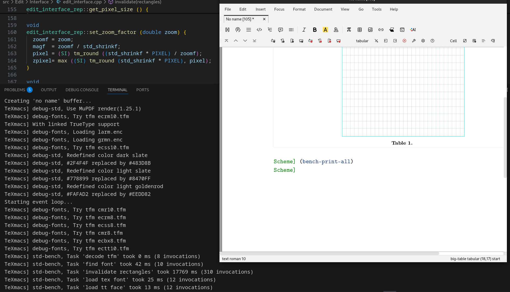
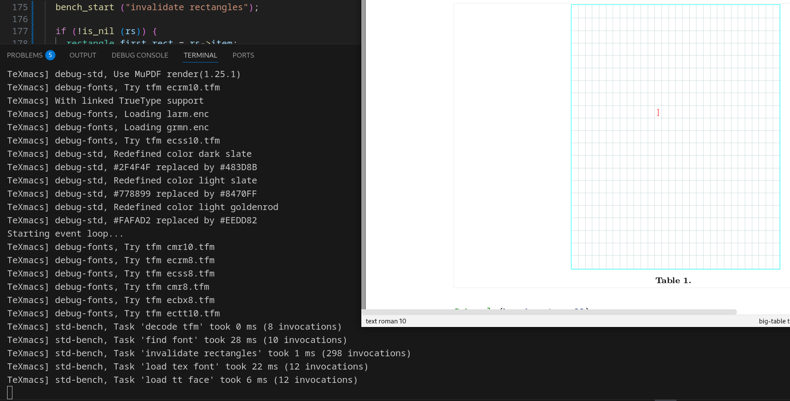

# 207_10 优化表格插入卡顿

## 2025/09/11 优化 `invalidate` 实现

路径是 `./src/Edit/Interface/edit_interface.cpp`

单元测试运行方法

```
xmake build invalidate_test

xmake run invalidate_test
```


### Why

原实现会对 `rectangles` 中的每一个矩形逐一调用 `invalidate`，在矩形数量较多时带来额外的开销。
新的实现通过求所有矩形的四个边界仅调用一次 `invalidate`，减少了函数调用次数和重绘区域处理次数。

虽然该处理会重绘一些不必要的区域，但根据测试结果和实际使用上看，其开销远远小于反复调用 `invalidate` 。

### What

优化了 `edit_interface_rep::invalidate(rectangles rs)` 的实现。

### result

在测试创建30*20的大表格时，`invalidate rectangles` 从 **\~17.7s/310次**提升至 **1ms/298次**。

优化前：


优化后：



## 2025/09/04 增加单元测试

路径是`./tests/Kernel/Types/rectangles_test.cpp`

运行方法 
```
xmake build rectangles_test

xmake run rectangles_test
```


### Why
保证优化后的正确性。

### What
增加单元测试


## 2025/09/02 优化 disjoint_union

### Why
原本是递归实现，耗时较多

### What
将 `disjoint_union`算法从递归改为迭代。

### result
热点基本消失。

优化前


优化后
