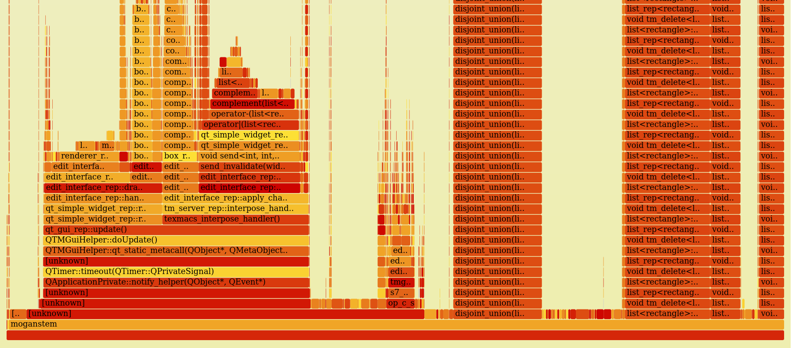
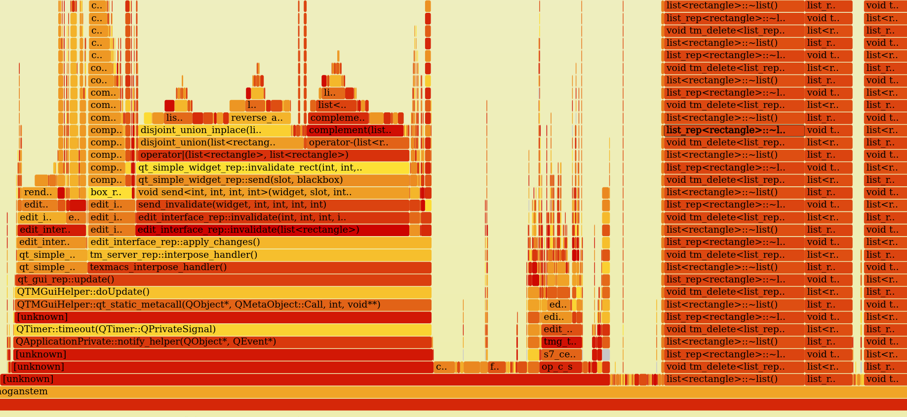

# 207_10 优化表格插入卡顿

## 2025/09/04 增加单元测试

路径是`./tests/Kernel/Types/rectangles_test.cpp`

运行方法 
```
xmake build rectangles_test

xmake run rectangles_test
```


### Why
保证优化后的正确性。

### What
增加单元测试


## 2025/09/02 优化 disjoint_union

### Why
原本是递归实现，耗时较多

### What
将 `disjoint_union`算法从递归改为迭代。

### result
热点基本消失。

优化前


优化后
