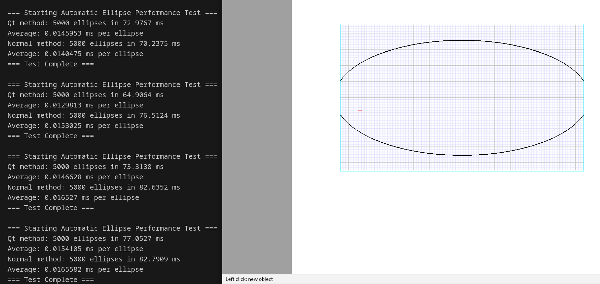
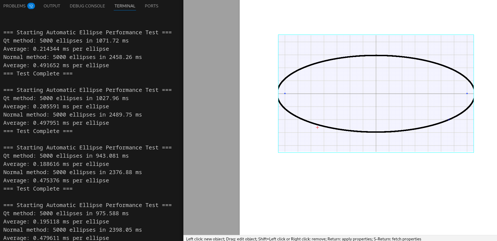
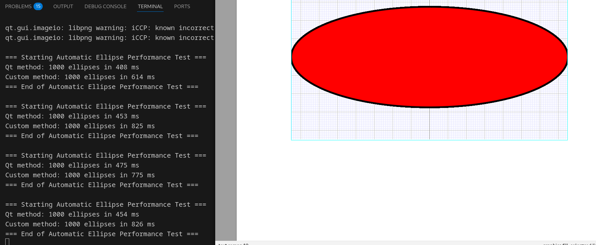
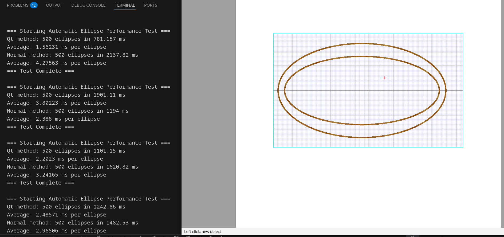

# 207_3 绘图工具中的椭圆渲染

## 2025/08/29 删除注释并更新了测试方法

更新的测试框架位于文档底部，可直接复制粘贴

### What
删除了注释，按照目前框架更新了测试方法

### Why
原来的测试方法不兼容新的框架

## 2025/08/22 修改填充框架并删除无关代码

### What
删除`fill_ellipse` , 给`curve_box` 增加 `is_pending_ellipse` 布尔值并兼容现有框架
修改`set_pencil()`使之兼容qt填充
修正画点时不更新pencil状态的bug

### Why
`drawEllipse()`自带填充行为，但是由于椭圆初次绘制时是线段，这会导致无法调用qt的填充方法，所以需要判断该线段是否是椭圆的一部分。
旧版代码由于框架缺陷，确定焦点时会调用默认的填充方法，即`poligon()`，从而降低性能。
如果画点不更新point，那么它的轮廓线就会复用上一次的绘制导致错误。


## 2025/08/09 设置填充椭圆的补偿系数

### What
在 `fill_ellipse` 里面，把当前brush的alpha降至0.8再填充。填充好后回归原本的设置。


### Why

椭圆的旋转会导致对填充色的补偿行为，在相同的透明度下，椭圆的颜色看起来会比其他图形要深一些。


## 2025/08/09 修正set_brush的透明度设置

### What
使用Pixmap来设置填充笔刷的透明度

### Why
原本的 `painter->setOpacity (qreal (pattern_alpha) / qreal (255));` 无法兼容qt渲染，会导致填充色的透明度设置失效

## 2025/08/06 兼容接口

### What
兼容下面两个通用接口，为后续增加其他曲线的qt渲染做准备
```cpp
  virtual void draw_curve (curve c, bool filled= false);
  virtual bool support_native_curve (curve c);
``` 

### Why
让渲染函数`curve_box_rep::display(renderer ren)`与曲线类型解耦，只依赖统一接口，便于维护。


## 2025/08/05 增加渲染性能测试

### 优化理论依据

Qt 原生方法（如 `drawEllipse`）由 Qt 库底层实现，直接调用硬件绘制指令在屏幕空间连续地绘制，抗锯齿、平滑度、效率都很高。

Polyline 旧方法则是将椭圆采样为很多小线段，逐段调用 `drawPolyline`，本质上是“离散近似”，不够平滑，而且大量 drawLine 调用带来更多的的CPU开销。

### 测试方法
1. 注释掉原本`/mogan/src/Typeset/Boxes/Graphics/graphics_boxes.cpp` 原本的 `curve_box_rep::display(renderer ren)`，将本文档结尾的 `display`函数粘贴
2. 编译运行mogan，点击draw image选择椭圆绘制
3. 观察控制台输出

### 注意事项
本次commit为了方便测试把修改后的display函数放在了原函数下，并添加了注释。在此pr完成时会删除代码中的测试函数，其内容会在本文档末尾留档。

### What
在 `curve_box_rep::display` 函数中内置了测试流程，可在一次渲染时自动对比 Qt 原生方法（优化后）和 polyline 采样方法（优化前）的性能，并输出统计结果。


### Why
优化后调用 Qt 库的 drawEllipse 等原生方法，理论上可提升渲染速度。但为了有说服力，需要真实代码路径下的实测对比，量化性能提升。

### How
1. 触发时机：每次调用 `curve_box_rep::display(renderer ren)` 渲染椭圆时自动运行。

2. 测试流程：

    a. 定义 TIMES（如 5000）轮循环, 具体次数可以在 `/mogan/src/Typeset/Boxes/Graphics/graphics_boxes.cpp` 的`TIMES`宏修改。

    b. 连续渲染 TIMES 个相同椭圆，分别采用新方法（Qt 原生）和旧方法（polyline/rectify）。

    c. 用 std::chrono::high_resolution_clock 测量每一轮总耗时，输出总时间和平均单个椭圆的渲染时间。

3. 渲染代码：见本文档结尾

### result

| 编号 | 场景描述               | Qt 方法性能                | Normal 方法性能           | 优劣结论          |
| -- | ------------------ | ---------------------- | --------------------- | ------------- |
| ①  | 空心 + 细轮廓线（ln1）     | 平均 \~0.013–0.015ms/个   | 平均 \~0.014–0.016ms/个  | **基本持平或略优**   |
| ②  | 空心 + 粗轮廓线（ln3–ln5） | 约 \~0.19–0.21ms/个      | 约 \~0.47–0.49ms/个     | **Qt 明显更优**   |
| ③  | 填充 + 粗轮廓线          | 约 \~0.40–0.45ms/个      | 约 \~0.7ms/个          | **Qt 明显更优**   |
| ④  | 材质笔刷    | Qt: \~2.2–3.8ms/个，波动极大 | Normal: \~2.3–4.3ms/个 | **难以判断，极不稳定** |

#### 空心 + 细轮廓线（ln1）


#### 空心 + 粗轮廓线（ln3–ln5）


#### 填充 + 粗轮廓线 


#### 材质笔刷


## 2025/08/04 修正了材质笔刷和轮廓线的bug

### What
1. 无法调整轮廓粗细
2. 材质笔刷时会自动填充颜色


### Why
`set_pencil()` 和 `set_brush`错误的设置了笔刷和画笔颜色

### notice
目前存在椭圆填充颜色和其他多边形透明度不一致的问题


## 2025/08/01 引入了qt renderer 渲染椭圆

### What
实现了用qt rendered渲染椭圆


### Why
原渲染方法较为低效导致画椭圆时会有卡顿

### notice
当前的方法还存在bug, 需仔细排查

测试代码：
```cpp
#include <chrono>

#define TIMES 1000

void
curve_box_rep::display (renderer ren) {
  int  i, n;
  bool use_native_drawing= ren->support_native_curve (c);

  if (use_native_drawing) {
    if (DEBUG_AUTO)
      debug_automatic << "\n=== Starting Automatic Ellipse Performance Test ===" << "\n";
    auto start = std::chrono::high_resolution_clock::now();
    for (i= 0; i < TIMES; i++) {
      ren->set_brush (fill_br);
      if (fill_br->get_type () != brush_none) {
        ren->draw_curve (c, true);
      }
      ren->set_pencil (pen->set_cap (cap_flat));
      if (pen->get_type () != pencil_none) {
        ren->draw_curve (c);
      }
      
    }
    auto end = std::chrono::high_resolution_clock::now();
    auto duration = std::chrono::duration_cast<std::chrono::milliseconds>(end - start).count();
    if (DEBUG_AUTO)
      debug_automatic << "Qt method: "<< TIMES <<" ellipses in " << duration << " ms" << "\n";
  }


  int tmp = 1;
  if (use_native_drawing && !is_pending_ellipse)
    tmp = TIMES;
  auto start = std::chrono::high_resolution_clock::now();
  for(int cnt = 0; cnt < tmp; cnt++) {
    ren->set_brush (fill_br);
    if (!is_pending_ellipse && fill_br->get_type () != brush_none) {
        n= N (a);
        array<SI> x (n), y (n);
        for (i= 0; i < n; i++) {
          x[i]= (SI) a[i][0];
          y[i]= (SI) a[i][1];
        }
        ren->polygon (x, y, false);
    }
    ren->set_pencil (pen->set_cap (cap_flat));
    if (pen->get_type () != pencil_none) {

      // TODO: Add options for handling round/nonround joins & line ends
      if (N (style) == 0) {
          n= N (a);
          array<SI> x (n), y (n);
          for (i= 0; i < n; i++) {
            x[i]= (SI) a[i][0];
            y[i]= (SI) a[i][1];
          }
          ren->lines (x, y);
      }
      else {
        SI li= 0, o= 0;
        i= 0;
        int   no;
        point prec= a[0];
        for (no= 0; no < N (styled_n); no++) {
          array<SI> x, y;
          point     seg= a[i + 1] - a[i];
          while (fnull (norm (seg), 1e-6) && i + 2 < N (a)) {
            i++;
            seg= a[i + 1] - a[i];
          }
          if (fnull (norm (seg), 1e-6) && i + 2 >= N (a)) break;
          SI lno= styled_n[no] * style_unit, len= li + (SI) norm (seg);
          while (i + 2 < N (a) && lno > len) {
            li= len;
            if (no % 2 != 0) {
              // 1st subsegment of a dash, along with the next ones
              x << (SI) prec[0];
              y << (SI) prec[1];
              prec= a[i + 1];
            }
            i++;
            seg= a[i + 1] - a[i];
            len= li + (SI) norm (seg);
          }
          if (N (x) > 0 && no % 2 != 0) {
            x << (SI) prec[0];
            y << (SI) prec[1];
          }
          o= lno - li;
          if (i < N (a)) {
            point b= a[i] + o * (seg / norm (seg));
            if (no % 2 == 0) prec= b;
            else {
              // Last subsegment of a dash
              if (N (x) == 0) {
                x << (SI) prec[0];
                y << (SI) prec[1];
              }
              x << (SI) b[0];
              y << (SI) b[1];
            }
          }
          ren->lines (x, y);
        }
      }
    }

    rectangles ll;
    if (!is_nil (arrows[0])) arrows[0]->redraw (ren, path (), ll);
    if (!is_nil (arrows[1])) arrows[1]->redraw (ren, path (), ll);
  }

  if(use_native_drawing) {
    auto end = std::chrono::high_resolution_clock::now();
    auto duration = std::chrono::duration_cast<std::chrono::milliseconds>(end - start).count();
    if (DEBUG_AUTO) {
      debug_automatic << "Custom method: "<< TIMES <<" ellipses in " << duration << " ms" << "\n";
      debug_automatic << "=== End of Automatic Ellipse Performance Test ===" << "\n";
    }
    
  }
  
}
```  