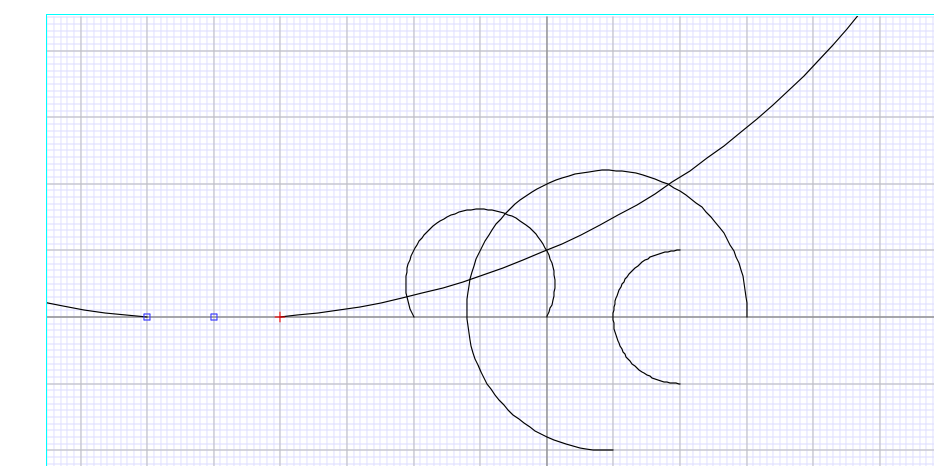
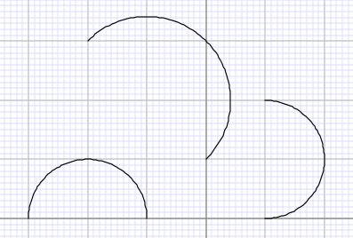

# 23_27 修复了无法画半圆的问题

## 如何测试
参考 https://github.com/XmacsLabs/mogan/pull/2212
添加单元测试以便通过 xmake run 23_27 进行测试。

## 2025/09/22

### What
修复了两个小bug.

当前环境无法正确画半圆。
当选择第三点在圆心（第一点）时会发生除0错误。

### Why
绘制弧线时，我们会指定弧线的圆心c，起点p和终点x。
程序会用这些点来计算弧线的第三点m，并用p, m, x绘制弧线。
默认方向为逆时针，尽管命名为“标准弧”。
绘制半圆时，vec-c-p与vec-c-q的夹角应为180度。
原代码错误地将vec-c-p作为第三点m。
此时仍需区分顺时针/逆时针方向，并添加指向中心点的正确向量作为第三点。
- 修改前

- 修改后


将c与q的距离设为r1可避免控制台异常提示，例如：

```scheme
;/: division by zero, (/ 0.0 0.0)
;    (let ((n (length opts))) (cond ((= n...
;    D:\mogan\build\packages\app.mogan\data\progs\kernel\library\base.scm, line 270, position: 0
; (let ((n (length opts))) (cond ((= n 0) (... ; f: 0.0
; (f2s (/ (point-get-x pt) f))               ; pt: (point "0.0" "0.0")
; (list-values 'point (f2s (/ (point-get-x ...
; std-arc-helper: (equal? (point-get-unit v... ; vec-c-p: (point "2.0" "0.0")
;                                              vec-c-q: (point "0.0" "0.0")
```
