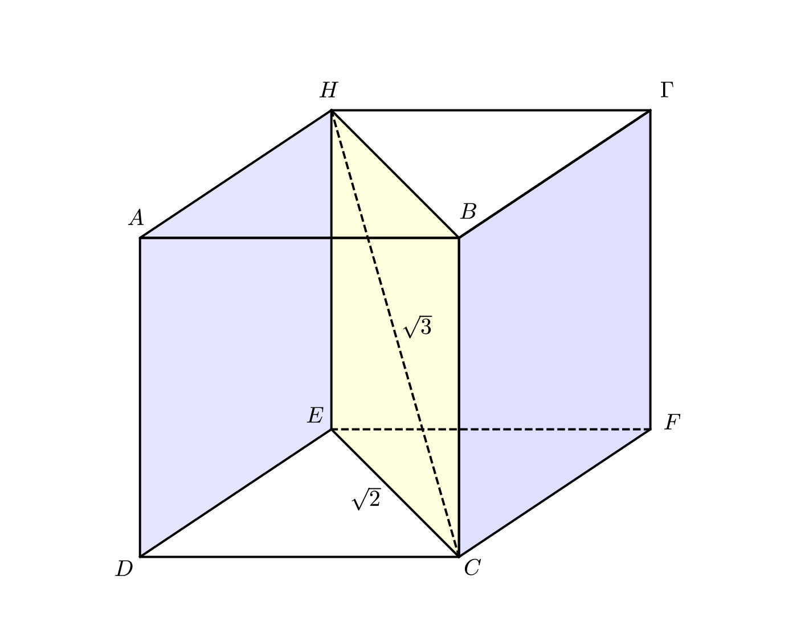
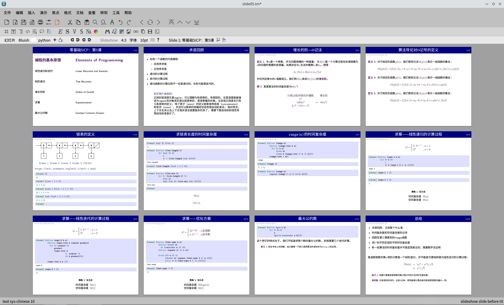
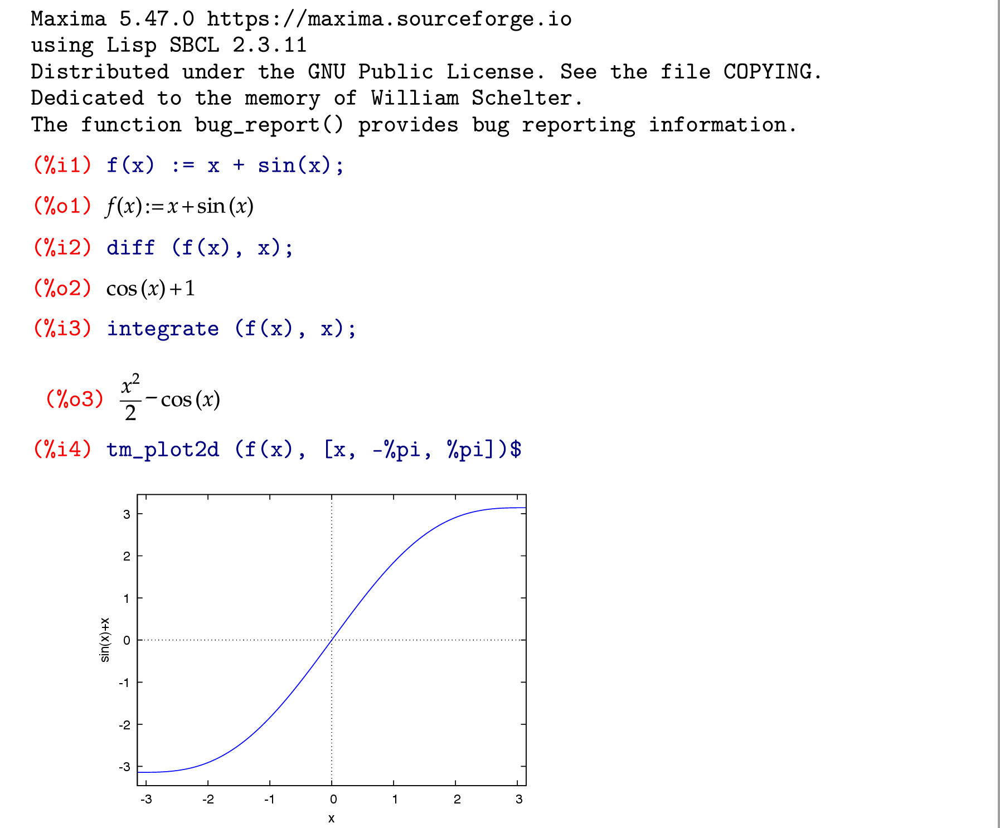
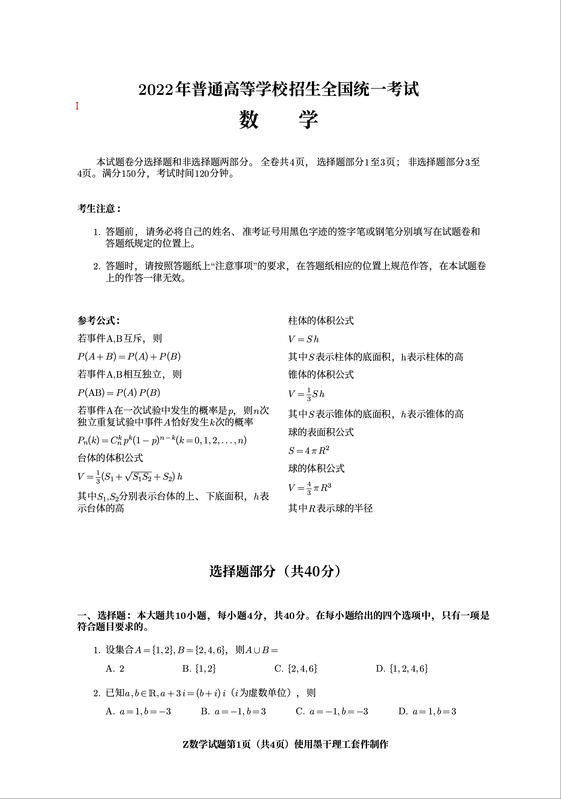

# 截图
## 数学模式：多行公式

## 文本模式:[《交互式SICP》](https://gitee.com/XmacsLabs/interactive-sicp)的第1.2.2小节

## 绘图模式: 立体几何示例

截图源自[使用TeXmacs绘制一个简单的几何图形](https://www.bilibili.com/video/BV1uu411W7xZ/)，作者是Massimiliano Gubinelli。

## 幻灯片: 零基础SICP第五课的幻灯片全景

## Maxima插件: 计算机代数系统的集成示例

## 试卷: 2022年浙江省高考数学试卷的第一页

 