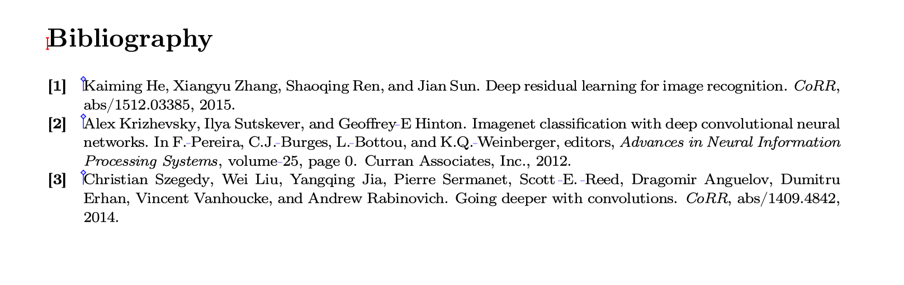
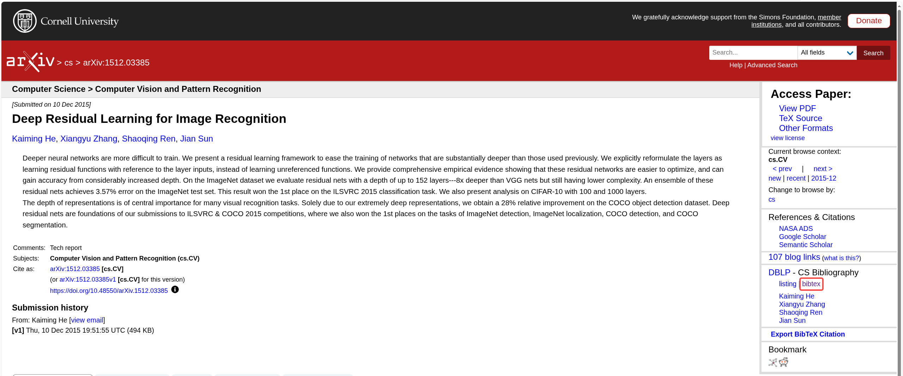
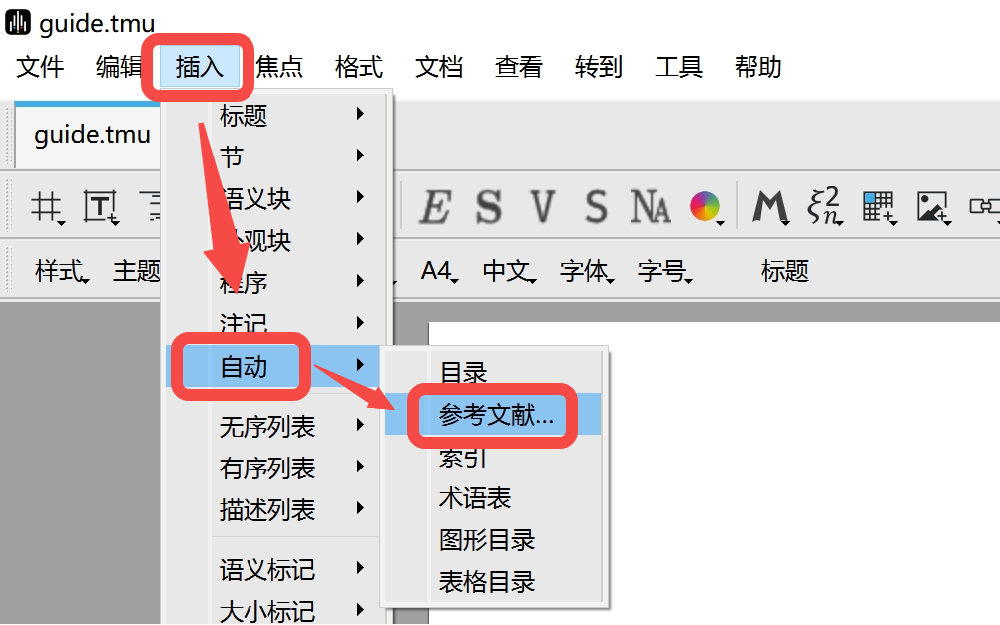
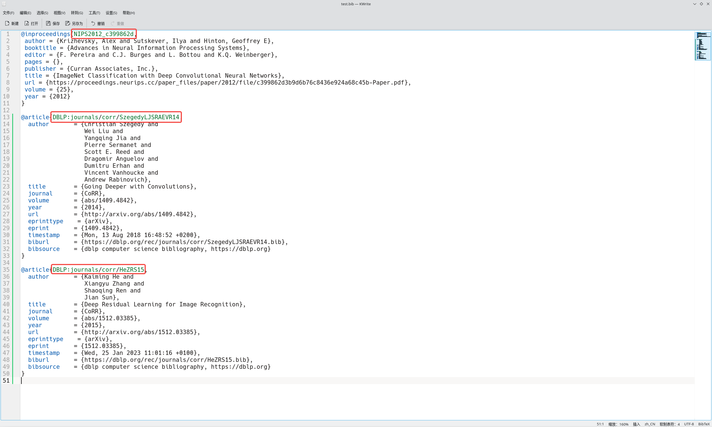
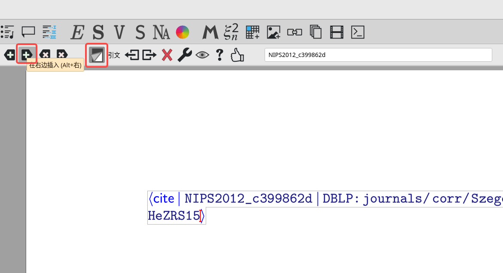
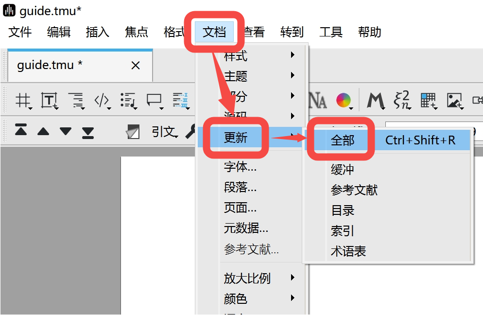

# Liii STEM的参考文献插入

文档来自 [Liii STEM 官网](https://liiistem.cn/docs/guide-cite.html)。该官网的文档会持续更新，墨干通常会及时同步更新内容，但可能存在一定延迟，请以官方文档为准。

   
   >本文将指导您如何插入参考文献，帮助您实现如上图所示的效果。

## 功能介绍

该功能提供了**BibTeX格式**的参考文献自动**识别**、**生成**、**排版**功能。用户仅需输入每篇文献的**key**，系统会自动生成规范的参考文献列表。

## 参考文献插入的使用流程

第一步 **获取BibTeX文件**  
   - 在学术平台搜索您想要引用的文献，进入文献信息界面，点击`bibtex`->`download`或者直接复制BibTeX文本。如下图所示：
   
   - **多篇文献**处理方案：
   将文献的BibTeX文本放在同一个bib文件中。

   > **注**  
   > ① 本操作以arxiv平台为例，各个平台操作方式大致相同。  
   > ② bib文件内容也可以自行根据文献信息输入。

第二步 **导入bib文件**  
   - 启动Liii STEM，在工具栏按序点击：  
     `插入` -> `自动` -> `参考文献`（如下图所示）
       
   - 选中本地保存的bib文件并打开  

第三步 **插入文献引用**  
此时您能在页面上看到被蓝框选中的“参考文献”字样。
   - 切换至英文输入法，按序操作：  
   点击`\`，输入 `cite` 后回车，粘贴bib文件中文献的key（如下图所示）
  
   - **多篇文献**添加方式：  
     - 点击工具栏`带加号的右箭头`（如下图所示），再输入下一篇参考文献的key。以此类推。全部文献的key输入完毕后回车
  
     - 或者重复进行步骤3

   > **注**  
   > ① bib文件可以用记事本或其他专门应用打开。  
   > ② 输入的“cite”不能在参考文献的程序框中。
   > ③ 输入的key必须与bib文件中的key完全一致。
   > ④ 输入的key必须是唯一的。

第四步 **生成参考文献**  
此时您能在页面上看到被蓝框选中的“[?]”图样。
   - 点击工具栏：  
     `文档` -> `更新` -> `全部`（如下图所示）。
     
   - 等待1-5秒后系统自动生成参考文献列表。
   > **注**  
   > 最终效果如下图所示。除生成的参考文献列表外，系统会保留您刚才输入的记录，您可以自行删除。  
   

## FAQ

1. **参考文献的key无法被识别**  
   web of science或其他学术平台上复制的BibTeX文本中的key可能无法被系统识别。系统报错提示如下图所示。   
  
   解决：自行手动修改key的格式（如将`WOS:86279275`修改为`86279275`）。

2. **参考文献顺序自动调整**  
   系统按文献长度自动排序，此功能暂无法取消。  

3. **注意文件位置管理**  
   如果您需要再次更新，请勿随意改动BibTeX文件的位置，因为更新功能依赖文档读取。

