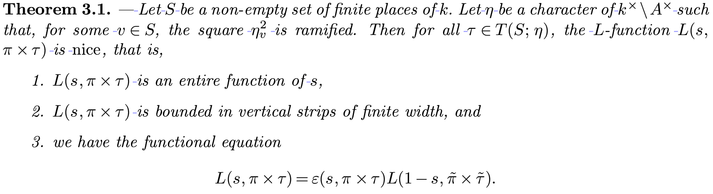
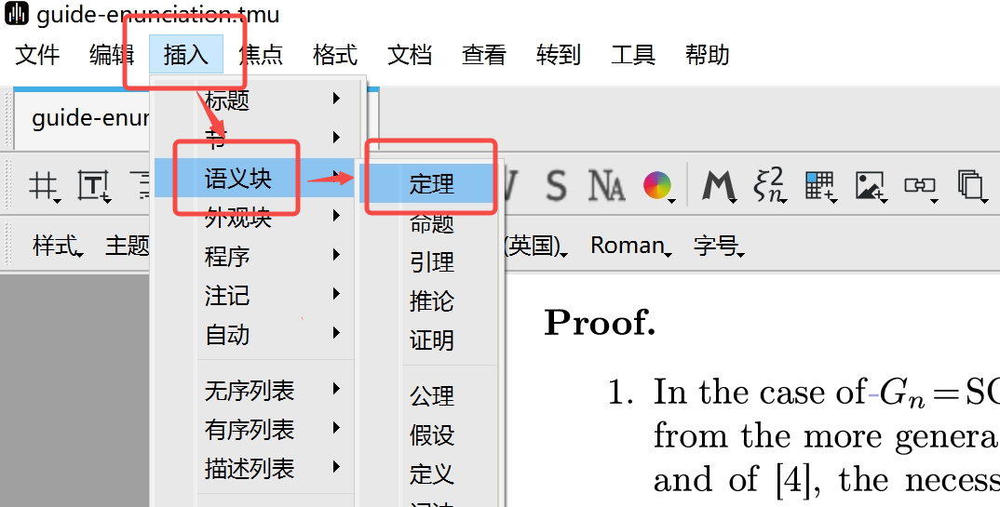
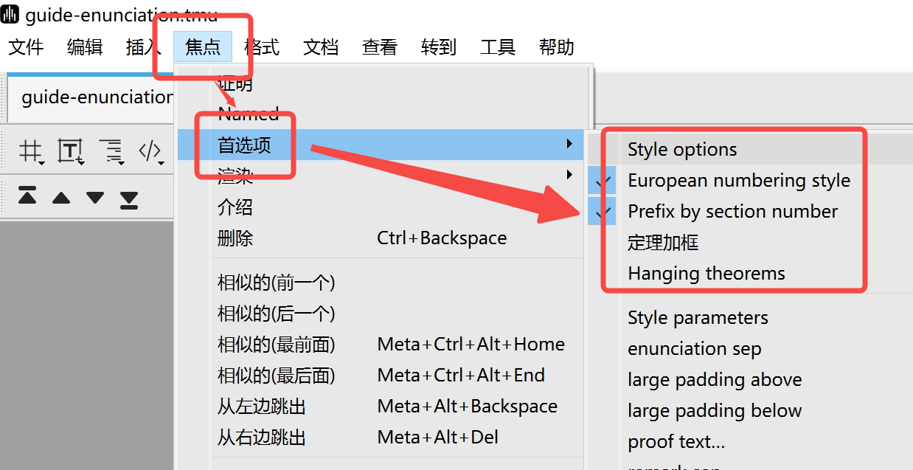
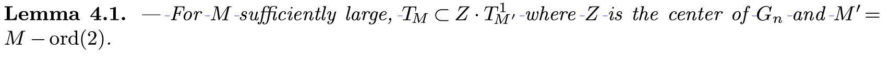
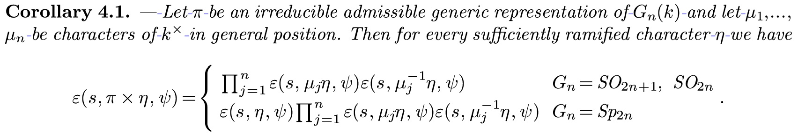
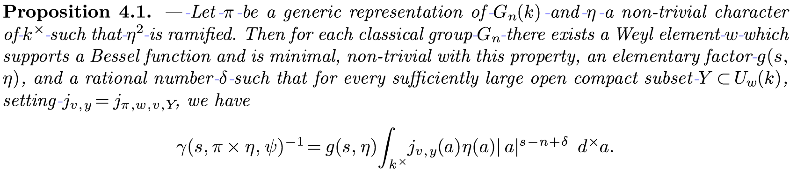
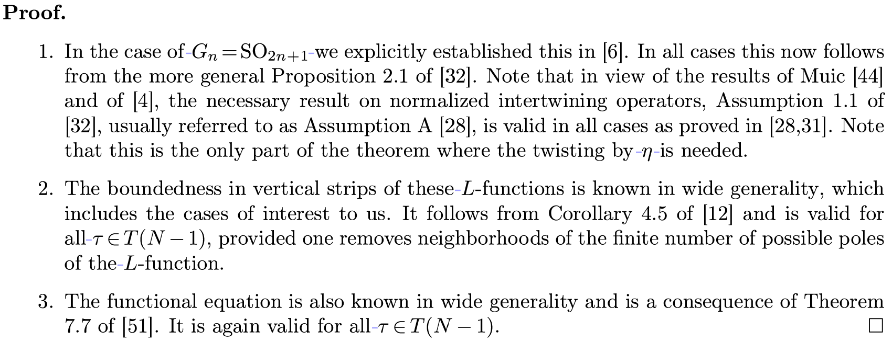

# Liii STEM的环境插入

文档来自 [Liii STEM 官网](https://liiistem.cn/docs/guide-enunciation.html)。该官网的文档会持续更新，墨干通常会及时同步更新内容，但可能存在一定延迟，请以官方文档为准。

## 一、功能介绍

该功能旨在通过插入**语义块（Enunciation）**，为您文章中的**定理（Theorem）**、**引理（Lemma）**、**推论（Corollary）**、**命题（Proposition）** 以及**证明（Proof）** 等部分配置合适的写作**环境**，以保证文章格式排版的美观与规范。本指南将帮助您实现下图展示的最终效果。     
  

## 二、操作流程

在工具栏依次点击`插入` -> `语义块` -> `定理`  
（您可以根据需要选择引理、推论、命题、证明等环境）（如下图所示）    
   

> 注：如果您需要**更多元**的编号或环境格式需求，请您按照以下步骤进一步操作  
> - 将光标置于您添加的语义块上  
> - 在工具栏依次点击`焦点` -> `首选项`（如下图所示）   
> - 选择您需要的编号或环境格式，具体格式解释如下表所示    
    
> 
> | 格式名称               | 说明                       |
> |------------------------|----------------------------|
> | European numbering style |       设置欧洲样式                   |
> | Prefix by section number |         添加章节层级                  |
> | Framed theorems         |             加框             |
> | Hanging theorems        |        加悬浮框                    | 

## 三、相关释例

1. **定理（Theorem）**：核心结论，需严格证明，代表文章主要贡献。  
    
2. **引理（Lemma）**：辅助性结论，为证明定理或命题提供中间步骤。  
    
3. **推论（Corollary）**：定理或命题的直接延伸结果，常需简短补充证明。 
     
4. **命题（Proposition）**：重要性次于定理的独立结论，可视为小定理或未命名定理。  
    
5. **证明（Proof）**：逻辑推导过程，验证定理、引理、命题或推论的正确性。  
    

## 四、注意事项
1. 在不同语言模式下，同一语义块的呈现效果存在差异。例如，"定理"中的内容在中文模式下呈现正体，而在英文模式下是斜体。  
2. 请您尽量单独使用语义块，避免在一语义块中嵌套另一语义块。  