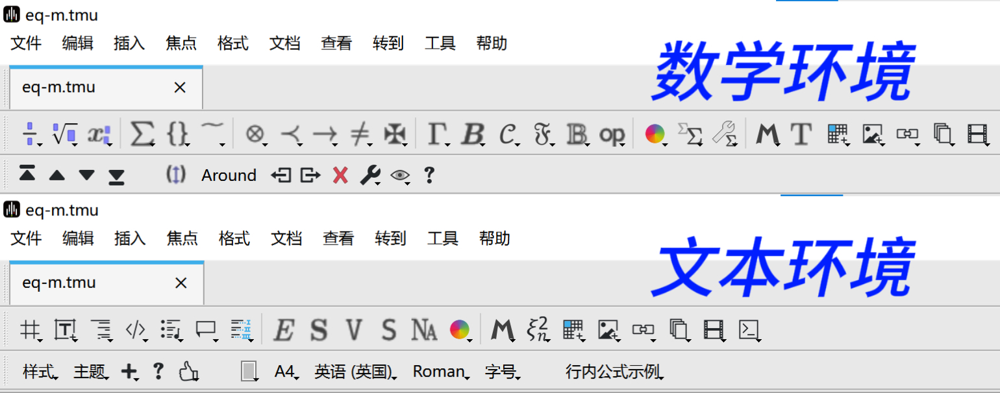
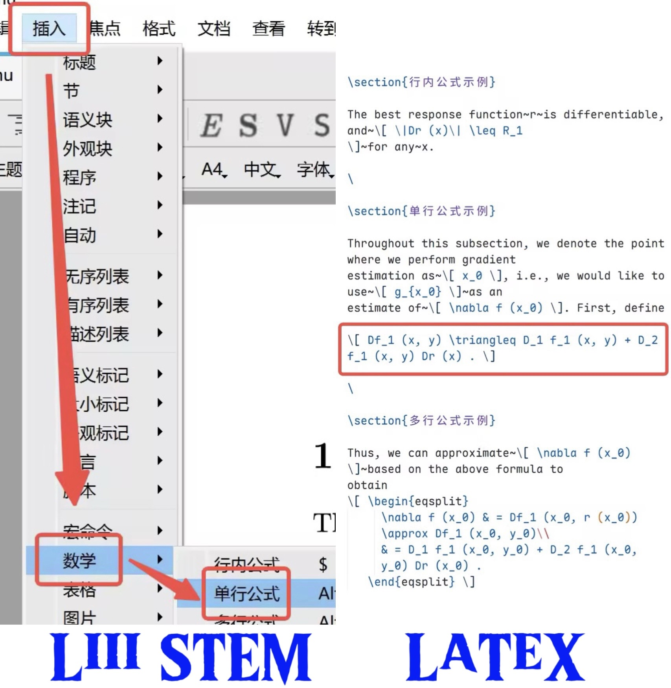
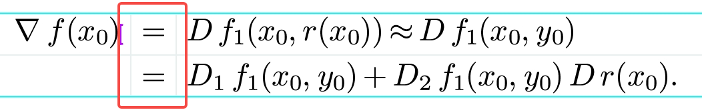
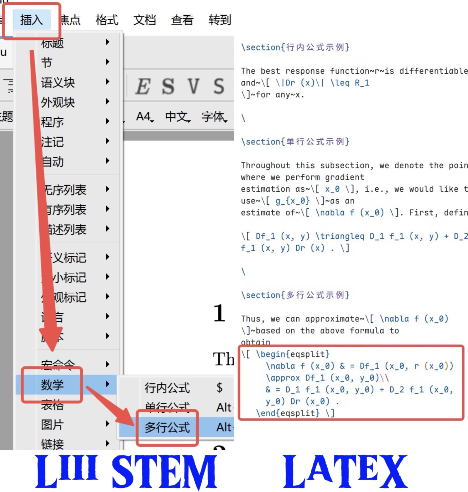
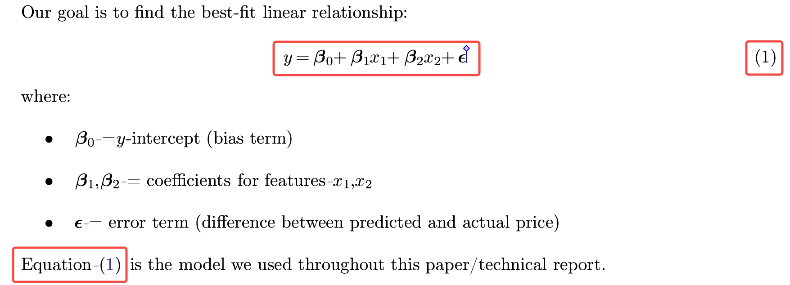
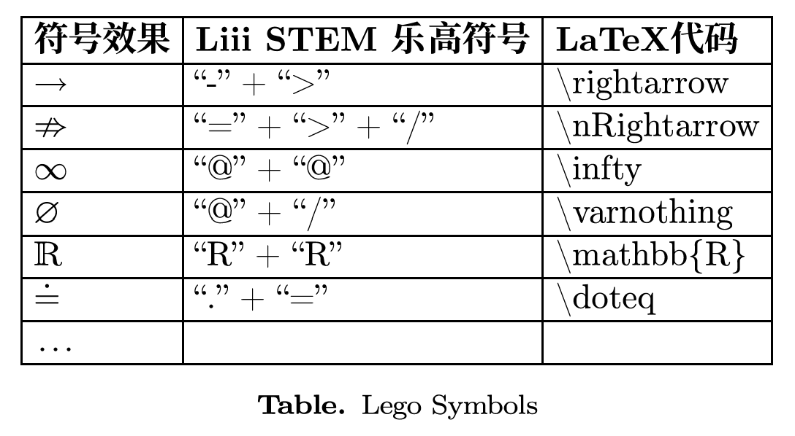
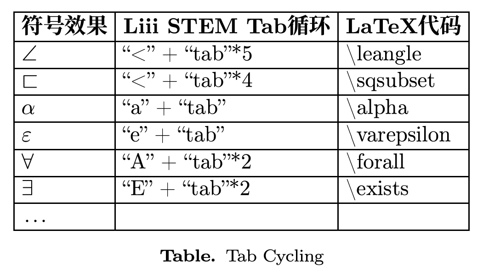
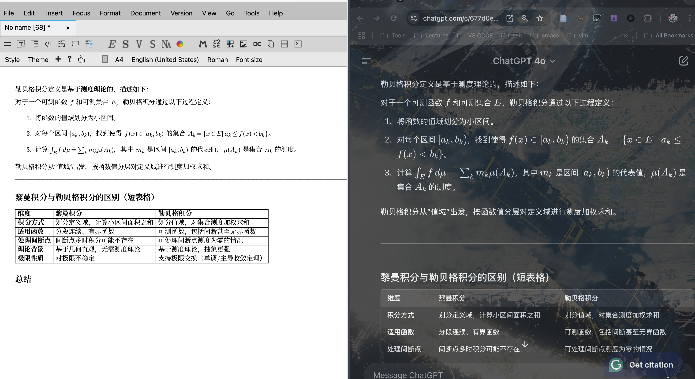

# Liii STEM 的数学公式快捷编辑

文档来自 [Liii STEM 官网](https://liiistem.cn/docs/guide-eqbj.html)。该官网的文档会持续更新，墨干通常会及时同步更新内容，但可能存在一定延迟，请以官方文档为准。

## 一、 功能介绍

Liii STEM 设置独立的**数学环境**，通过各类**简易方法**和**按键**，实现了数学公式的**快捷插入**和公式内字符的**快捷编辑**，帮助您最快速、最准确地完成您文章中公式的撰写。

同时，本指南对比了**Liii STEM**与**LaTeX**实现相同效果所需的操作**差异**，您可通过指南中的图片或表格阅览了解。

## 二、 基本用法

为确保格式的绝对规范，在 Liii STEM 中，我们设置了**独立的**数学环境和文本环境，不同的环境功能不同，**您可以使用 `$` 一键切换环境**。**请勿在数学环境中输入文本内容**。
本指南中的功能实现都基于数学环境。下图展示了不同环境下的工具栏样式。

### 1. 插入行内公式（inline formula）

- 在工具栏点击`插入` -> `数学` -> `行内公式`
- 或使用快捷键`$`
  

### 2. 插入单行公式（displayed formula）

- 在工具栏点击`插入` -> `数学` -> `单行公式`
- 或使用快捷键`alt` + `$`
  

### 3. 插入多行公式（aligned formula）

Liii STEM 提供了两种多行公式的格式，具体如下:

#### （1）$\backslash\texttt{align}$

- 确保输入法为英文
- 点击`\` -> 输入`align` -> 点击`回车`。
  > 注：  
  > 在此种格式下，符号请在**分割线左侧**输入，以保证符号两侧字距相等。

#### （2）$\backslash\texttt{eqnarray}$

即"equation array"格式，由于该格式存在符号两边字距间隔不一等问题，**在 AMS 标准中已被弃用**，请您在使用关注您文章的格式要求。

如果您使用"`插入` -> `数学` -> `多行公式`"或是快捷键"`alt` + `shift` + `7`"，只能实现上面（2）中的效果。

### 4. 公式的编号与引用（equation reference）

Liii STEM 支持文章中数学公式的**自动编号**，**双向链接**以保证序号的自动更新，以及在下文中规范而便捷地**引用**公式。效果如下图所示，具体使用方法请参照[Liii STEM 的公式编号与引用](./guide-eq.md)。

## 三、 快捷方法

### 1. 乐高符号（lego symbols）

在 Liii STEM 中，您可以使用不同字符进行**具象化拼接**，以生成**新的字符**。  
相较于复杂的 LaTeX 代码，我们的乐高符号以**图形**为设计思路，更加符合您**日常记忆规律**，能够最大程度减少您的写作负担。
例如，`<`和`>`可以表示方向，`@`可以表示圆圈，您可在这两个符号基础上衍生出数十个常用字符。效果如下图所示。  

### 2. Tab 循环（tab cycling）

在 Liii STEM 中，您可以通过`tab`在**形似符号**或是**希腊字母**中循环切换，通过`shift` + `tab`实现**逆向**切换。
我们仍然按照**形状记忆**的设计原则，仅通过**一个`tab`键**，您能够快速切换出数十种相似的新字符，彻底告别 LaTeX 代码记忆的苦恼。  
例如，由于$\forall$形似颠倒的`A`，您可以通过输入`A`并敲打两次`tab`实现。效果如下图所示。  

### 3. 魔法粘贴

Liii STEM 支持对数学公式无损复制粘贴，您可以从各类大语言模型（LLM）中**直接复制**内容到 Liii STEM 的 TMU 文档中。效果如下图所示，具体使用方法请参照[Liii STEM 的魔法粘贴](./guide-magic-paste.md)。  

> 注：
> 以上快捷方法都只做了简单列举，Liii STEM 还有**不计其数的快捷方法**来帮助您减轻论文写作压力，您可以通过以下途径发现更多的快捷编辑方式~
>
> - 我们的官方文档 [Liii STEM 的键盘快捷键](./keyboard_shortcuts.md)
> - 墨客社区教学视频 https://www.bilibili.com/video/BV122EGz5Ej4/?spm_id_from=333.337.search-card.all.click
