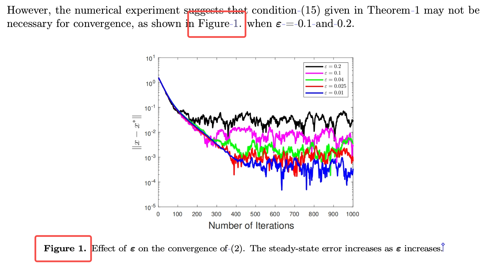
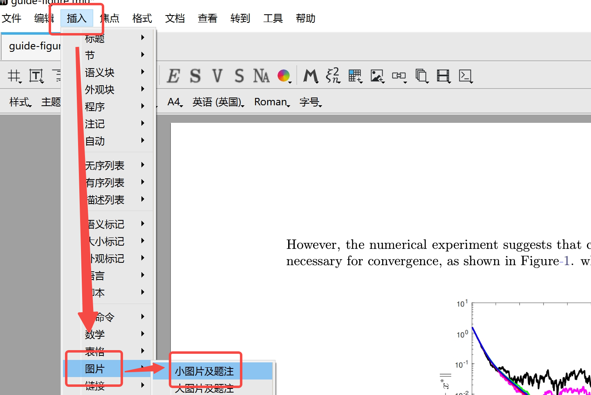
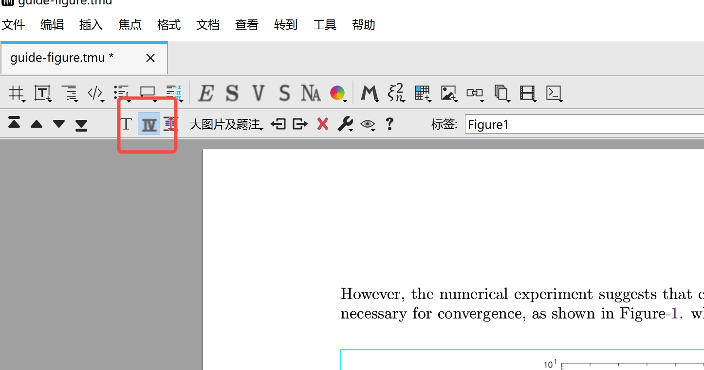
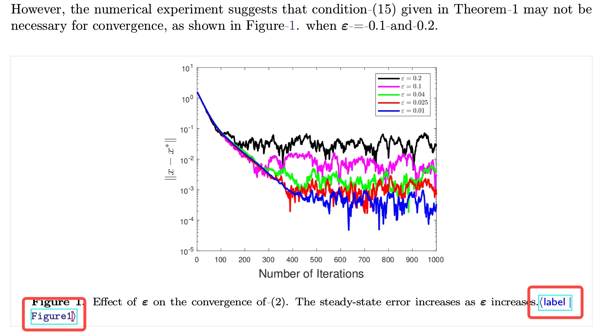
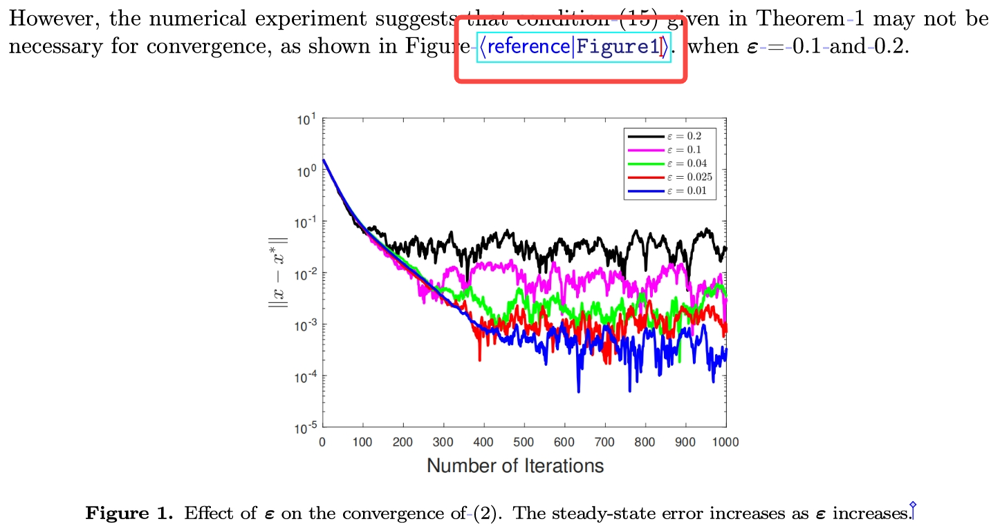
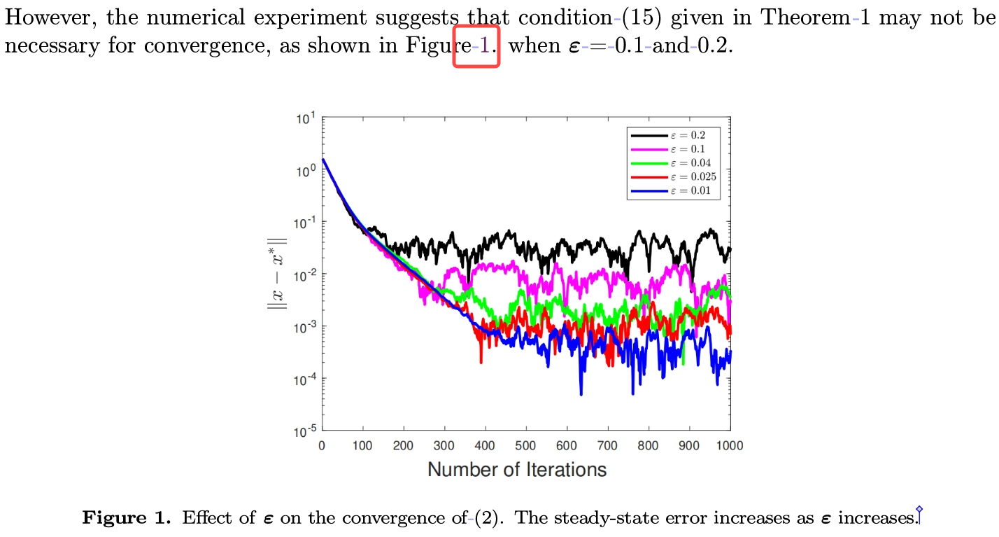

# Liii STEM的图片编号与引用

文档来自 [Liii STEM 官网](https://liiistem.cn/docs/guide-figure.html)。该官网的文档会持续更新，墨干通常会及时同步更新内容，但可能存在一定延迟，请以官方文档为准。

## 一、功能介绍  

该功能旨在实现您文章中图片的**自动编号**，双向链接以保证序号的**自动更新**，以及在下文中规范而便捷地**引用**您的图片。本指南将帮助您实现下图展示的效果。  
   

## 二、操作流程

#### *STEP 1.* 插入图片  
- 在工具栏依次点击`插入` -> `图片` -> `小图片及题注`（如下图所示）  
- 将您需要添加的图片粘贴至蓝色选框内  
  
>  注：一般情况下，在您插入图片后系统会自动编号。如发现未编号，您可将光标置于图片上，点击工具栏上的`Ⅳ`式样按键（如下图所示）自行实现。  
>    

#### *STEP 2.* 图片命名

- 将光标置于图片说明的末尾，确保输入法为英文模式   
- 点击`\`，输入`label`，（或使用快捷键：`ctrl`＋`!`），点击`回车`  
- 输入您图片的名称，如“Figure1”，点击`回车`（如下图所示）  
  

#### *STEP 3.* 建立双向链接

- 在您需要引用该图片的地方   
- 点击`\`，输入`ref`，点击`回车`   
- 再次输入您刚才命名的图片名称，点击`回车`（如下图所示）    
  

#### *STEP 4.* 插入Non-breaking Space

- 将光标置于您想插入的位置    
- 按住`空格`，点击`tab`（如下图所示）    
    
> 注：Non-breaking Space，即“不间断空格”，可以确保前后两部分位于同一行，不会因为换行而断开。