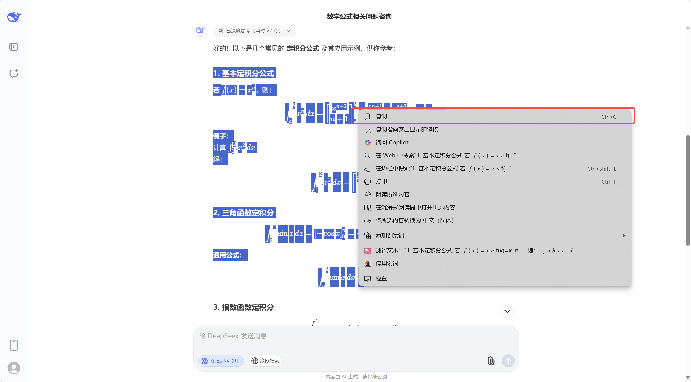
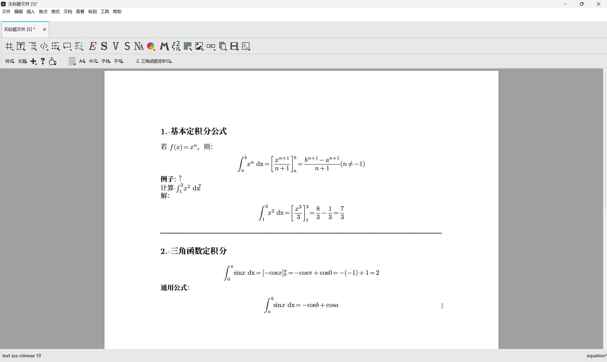
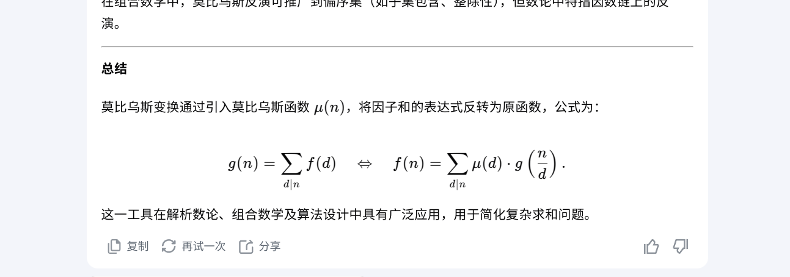
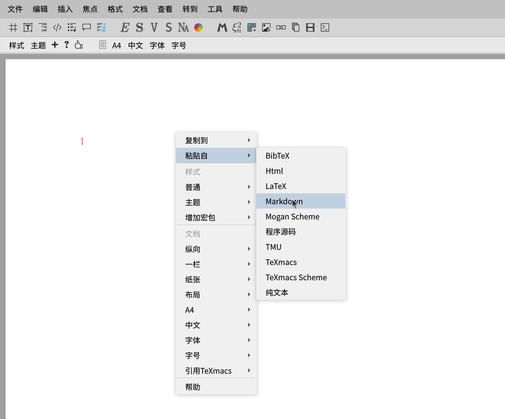
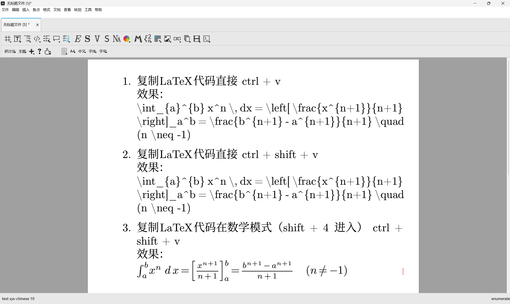

# Liii STEM的魔法粘贴

文档来自 [Liii STEM 官网](https://liiistem.cn/docs/guide-magic-paste.html)。该官网的文档会持续更新，墨干通常会及时同步更新内容，但可能存在一定延迟，请以官方文档为准。

## 魔法粘贴和智能粘贴的差异

### 魔法粘贴功能

魔法粘贴提供了对数学公式和表格的无损复制粘贴功能，您可以从各类大语言模型(LLM)中直接复制内容到Liii STEM的TMU文档中。
系统会自动将LLM生成的内容（包括代码、公式、表格等）转换为TeXmacs的标准格式，确保文档排版的专业性和一致性。

### 智能粘贴功能
**快捷键** 
- Windows\Linux: <kbd>ctrl</kbd> + <kbd>shift</kbd> + <kbd>v</kbd>
- MacOS: <kbd>Command</kbd> + <kbd>shift</kbd> + <kbd>v</kbd>

在文本模式下，执行纯文本粘贴 
在数学模式下，自动将LaTeX代码转换为Liii STEM数学公式

## 魔法粘贴使用指南

1. 在LLM（目前支持DeepSeek、豆包，后续开发会逐渐支持更多LLM）或知乎中选中你想要复制的内容，右键复制，如图所示：

**快捷键** 
- Windows\Linux: <kbd>ctrl</kbd> + <kbd>c</kbd>
- MacOS: <kbd>Command</kbd> + <kbd>c</kbd>

> 注意！不要直接点击DeepSeek左下角的复制，界面上的复制按钮，实际上复制得到的是Markdown格式。

2. 在Liii STEM中直接粘贴，效果如图所示：

**快捷键** 
- Windows\Linux: <kbd>ctrl</kbd> + <kbd>v</kbd>
- MacOS: <kbd>Command</kbd> + <kbd>v</kbd>

## 为何有时魔法粘贴会失效
- 一些网站如Kimi，文言一心的前端页面中不包含`LaTeX`源码，目前主要是基于`LaTeX`源码来提取数学公式
- 浏览器版本过低，推荐使用版本新的 Chrome、Edge 浏览器，后续会支持更多浏览器

## 魔法粘贴失效时的替代方案
- 直接点击大模型对话消息中最下面的复制按钮，此时复制的是`Markdown`格式

- 在 Liii STEM 中右键 -> 粘贴自 -> Markdown

## 智能粘贴使用指南
具体操作步骤如下图所示（可通过右键点击图片放大查看）：
