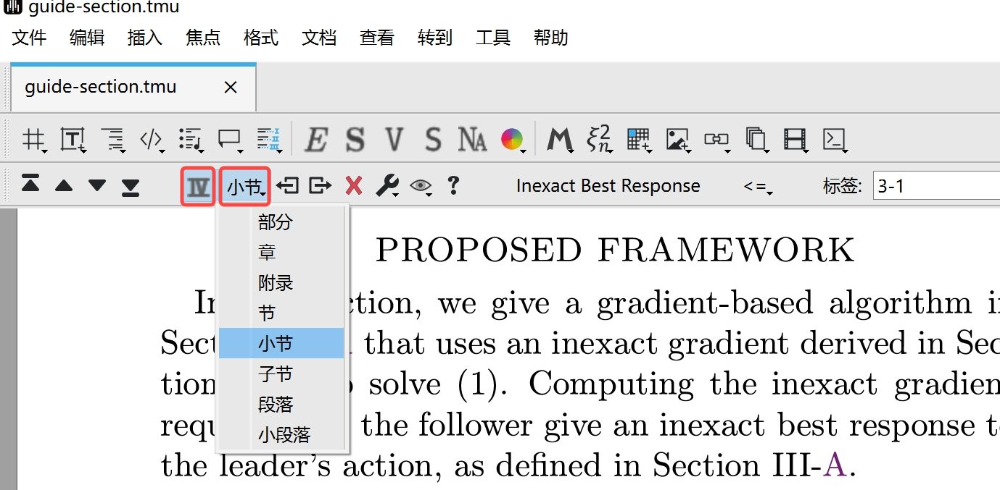
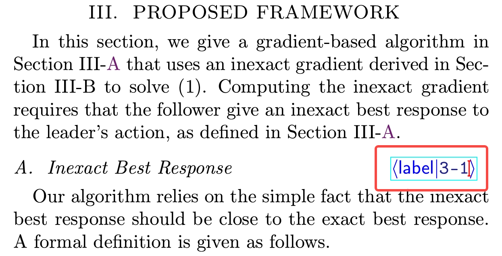
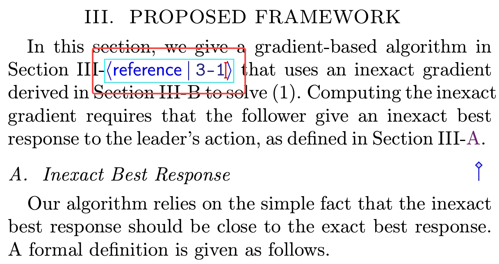

# Liii STEM的节编号与引用

文档来自 [Liii STEM 官网](https://liiistem.cn/docs/guide-section.html)。该官网的文档会持续更新，墨干通常会及时同步更新内容，但可能存在一定延迟，请以官方文档为准。

## 一、功能介绍  

该功能旨在实现您文章中不同层级的节（section）的**自动编号**，双向链接以保证序号的**自动更新**，以及在下文中规范而便捷地**引用**您的节。本指南将帮助您实现下图展示的效果。操作以"小节"层级为例，其他层级的节同理。   
   

## 二、操作流程

#### *STEP 1.* 插入节  
- 在工具栏依次点击`插入` -> `节` -> `小节`（如下图所示）  
  

>  注：
> - 一般情况下，在您插入节后系统会自动编号。如发现未编号，您可将光标置于节上，点击工具栏上的`Ⅳ`式样按键自行实现。  
> - 您还可以在工具栏快速调换节的层级。（如下图所示）  
>   

#### *STEP 2.* 节命名

- 将光标置于节的末尾，确保输入法为英文模式   
- 点击`\`，输入`label`，（或使用快捷键：`ctrl`＋`!`），点击`回车`  
- 输入您节的名称，如"section3-1"，点击`回车`（如下图所示）  
  

#### *STEP 3.* 建立双向链接

- 在您需要引用该节的地方   
- 点击`\`，输入`ref`，点击`回车`   
- 再次输入您刚才命名的节名称，点击`回车`（如下图所示）    
    