# LiiiSTEM结构化搜索与替换使用指南

文档来自 [Liii STEM 官网](https://liiistem.cn/docs/guide-structured-search-and-replace.html)。该官网的文档会持续更新，墨干通常会及时同步更新内容，但可能存在一定延迟，请以官方文档为准。

## 一、基础搜索与替换功能

### 1.1 功能入口

‌菜单栏路径‌：

`编辑` ➔ `查找` | `替换`

`查看` ➔ `搜索工具栏` | `替换工具栏`

### 1.2 跨平台快捷键对照表

| 操作 |	macOS 快捷键 |	Windows 快捷键|
|-----|----------------|--------------|
| 查找 |	⌘ Command + F |	Ctrl + F |
| 替换 | 	⌘ Command + R |	F2 |

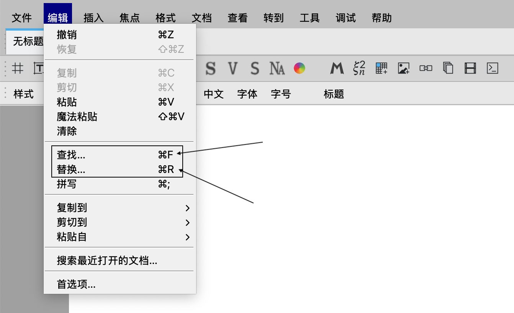

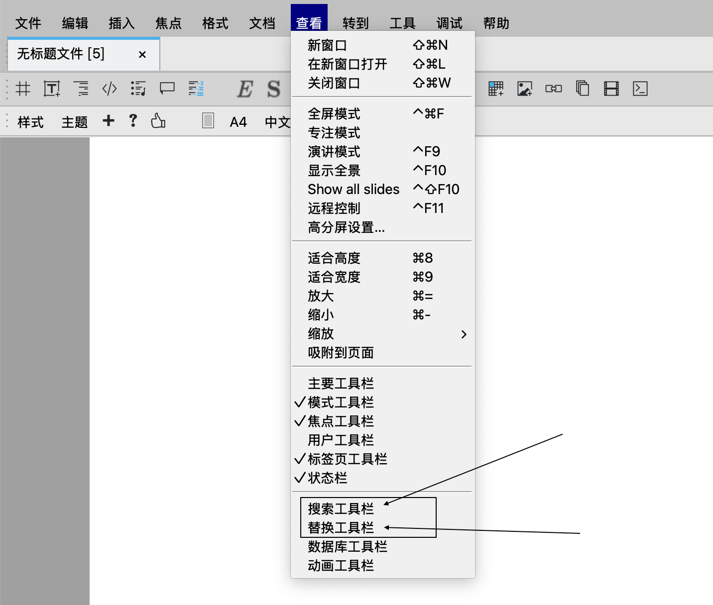

基础搜索或替换功能：软件底部可进行纯文本的普通搜索或替换

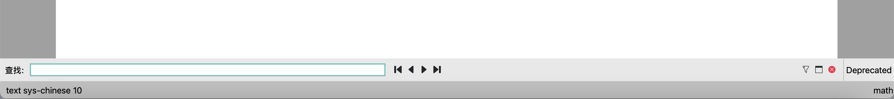

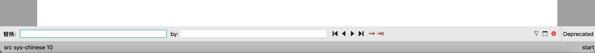

## 二、搜索或替换的模式强相关

### 2.1 搜索或替换与当前所处的模式强相关

文档里有不同模式，依据当前光标所处的位置不同，软件左下角会显示当前所处模式，例如：

- 文本模式
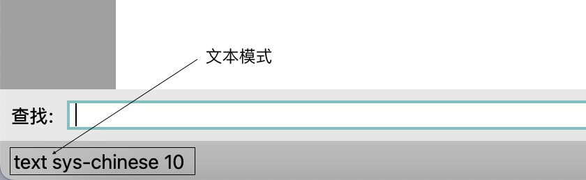

- 数学模式
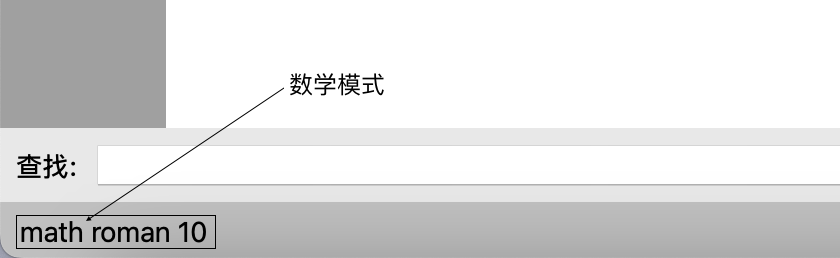

- 代码模式
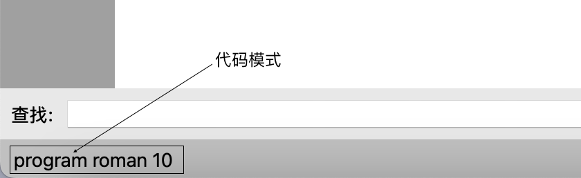

## 三、结构化搜索与替换

### 3.1 ‌激活结构化界面

点击右下角如图所示按钮激活结构化界面

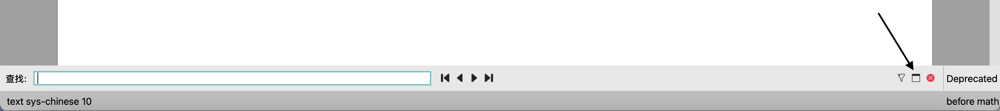

在下图所示的输入框中可以输入结构化内容

例如可以输入一个分式

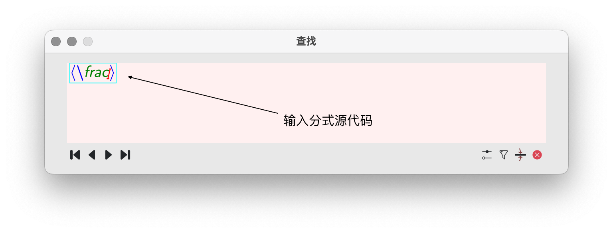

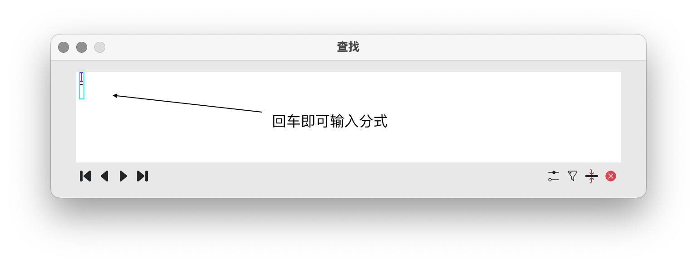

### 3.2 文档源代码

如果想知道当前文档的源代码，可以如图下操作：

`文档` ➔ `源码` ➔ `编辑源码树`

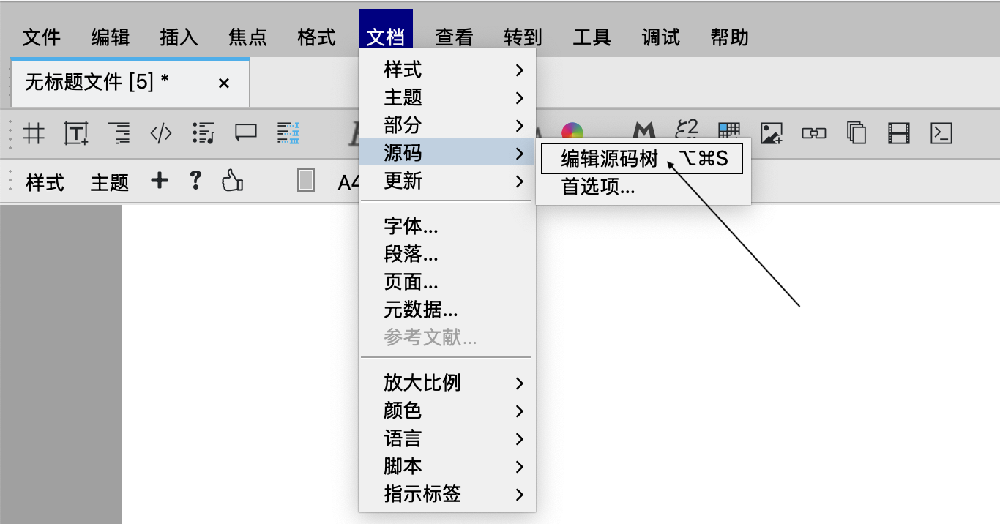

## 四、案例

**典型用例**：  

- 查找所有红色标注的"LiiiSTEM"文本

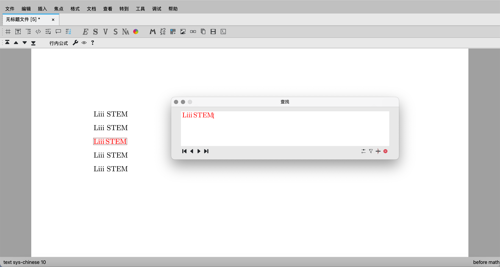

- 查找数学模式下所有分子为 "1" 的分式

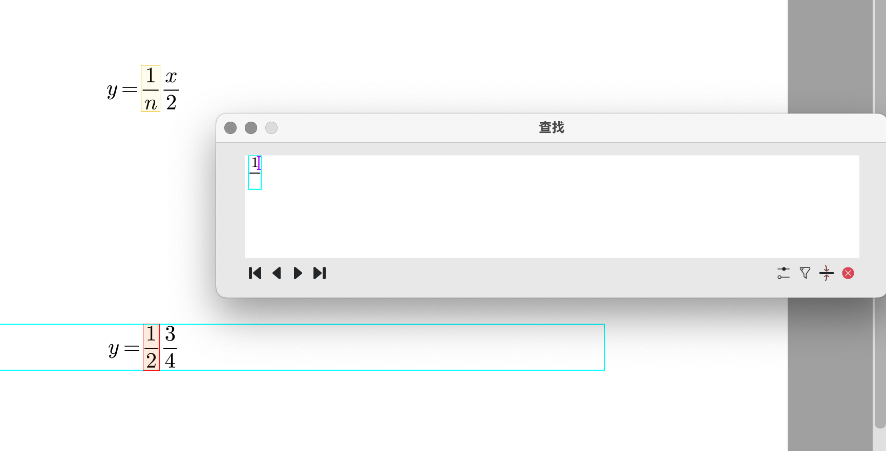

- 查找数学模式下所有分母为 "2" 的分式

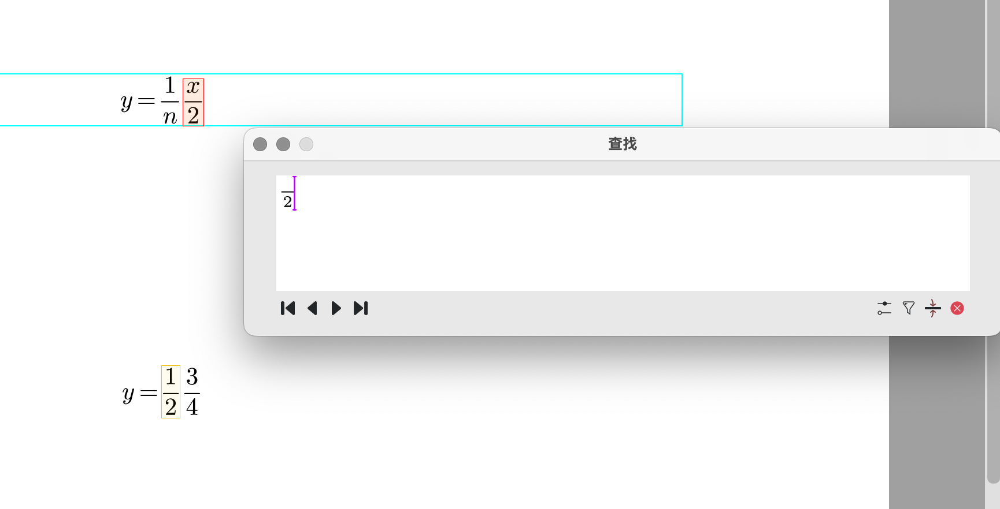

- 查找数学模式下所有矩阵（Matrix）

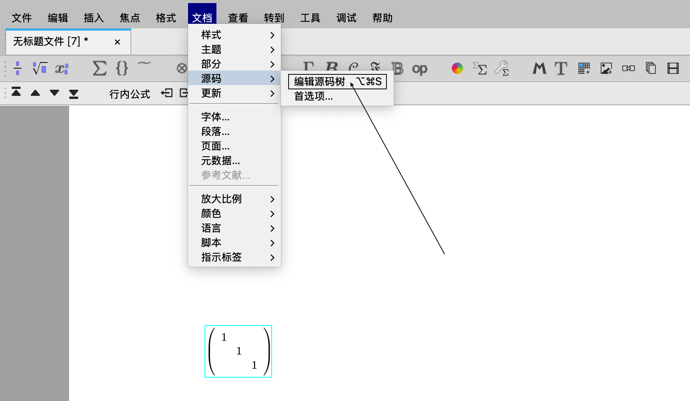

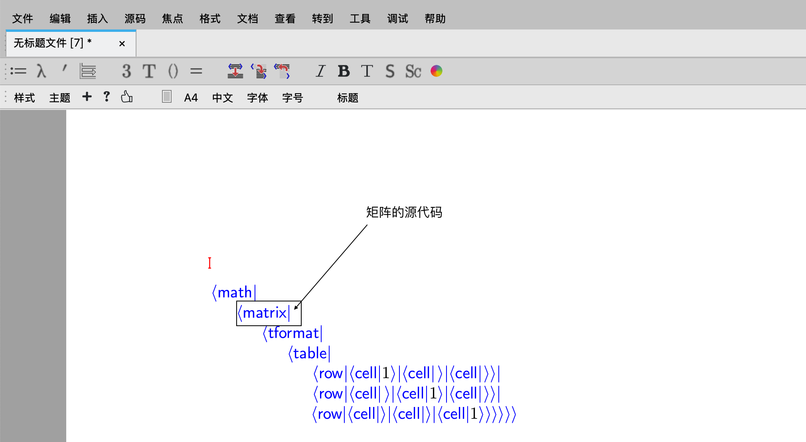

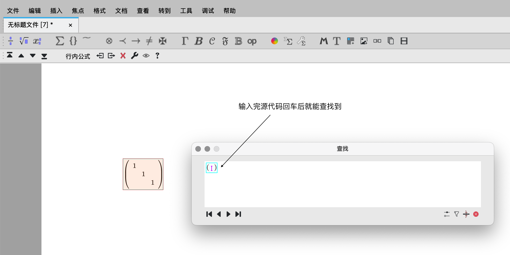