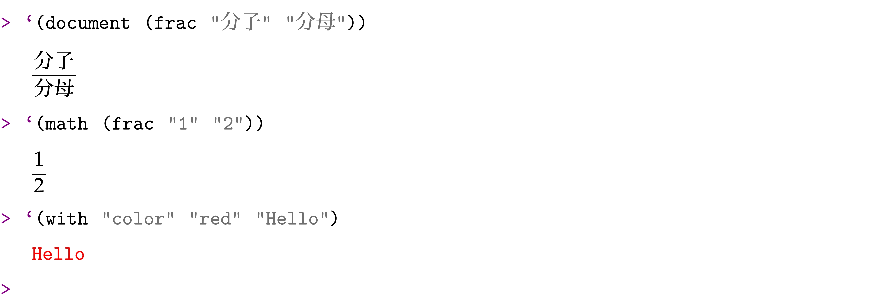
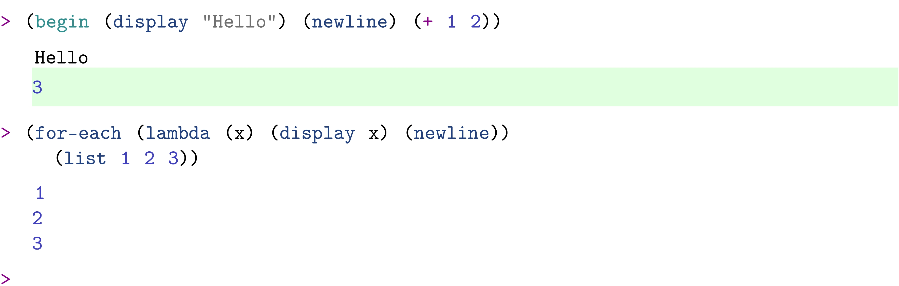

# 金鱼 Scheme

[金鱼 Scheme](https://gitee.com/LiiiLabs/goldfish)是三鲤 Scheme 的社区版，墨干理工套件是三鲤理工套件的社区版。

金鱼 Scheme 作为插件内置在墨干理工套件中，Goldfish Scheme 本身不提供 REPL 的实现，墨干理工套件中提供了 Goldfish Scheme 的结构化 REPL。

Scheme 语言的初学者，可以在墨干中利用 Goldfish Scheme 学习符合 R7RS 标准的 Scheme 语言。

## 结构化 REPL

结构化 REPL 和常见的 REPL 的显著区别是输入和输出都可以是结构化的。对于编程语言的 REPL，一般来说，输入都是纯文本格式的代码；在 Racket 中，支持在代码中将图片作为代码的一部分。在金鱼 Scheme 会话中，输入仍旧是纯文本的 Scheme 代码，输出则是结构化文档。本文档以如下示例展示金鱼 Scheme 会话的结构化输出效果：

### 特殊的渲染规则

墨干的文档本质上是 Scheme 代码，金鱼 Scheme 会话的求值结果，如果以`document`、`math`、`equation*`、`align`、`with`、`graphics`开头，那么会被渲染为墨干文档片段：

### 区分副作用和求值结果

求值结果以浅绿色的背景色标注。副作用的背景色是文档的背景色，通常是白色。

## 安装

无须安装，Goldfish Scheme 本身和 Goldfish Scheme 插件都是在墨干中内置的。

## 内置文档见`帮助->插件->Goldfish Scheme`
