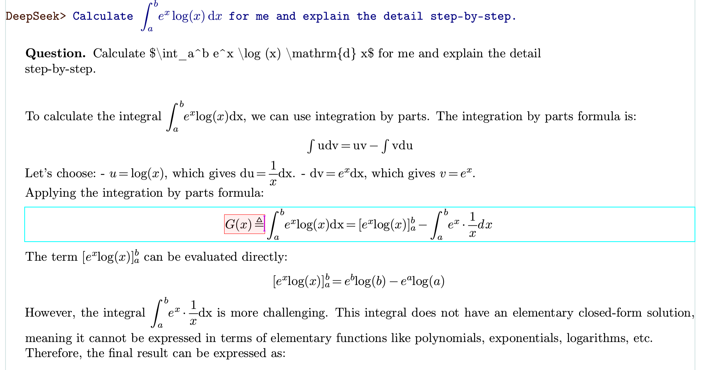
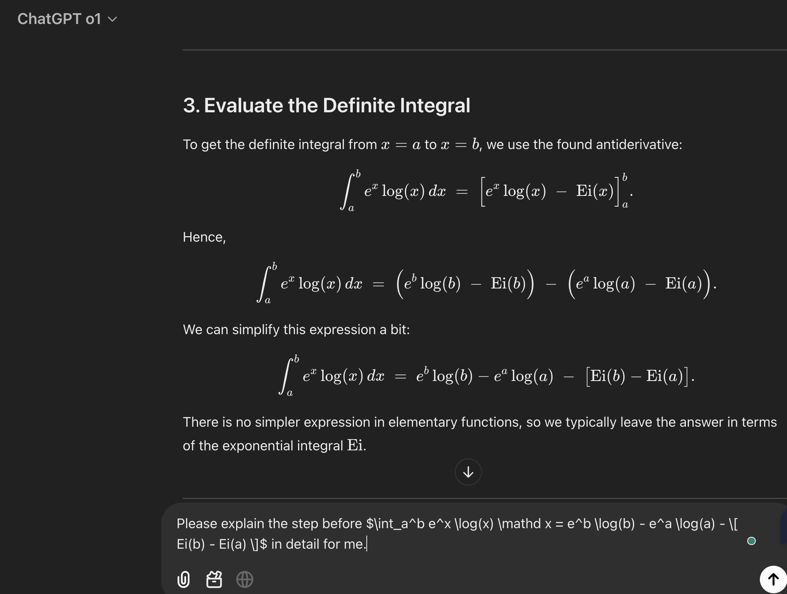
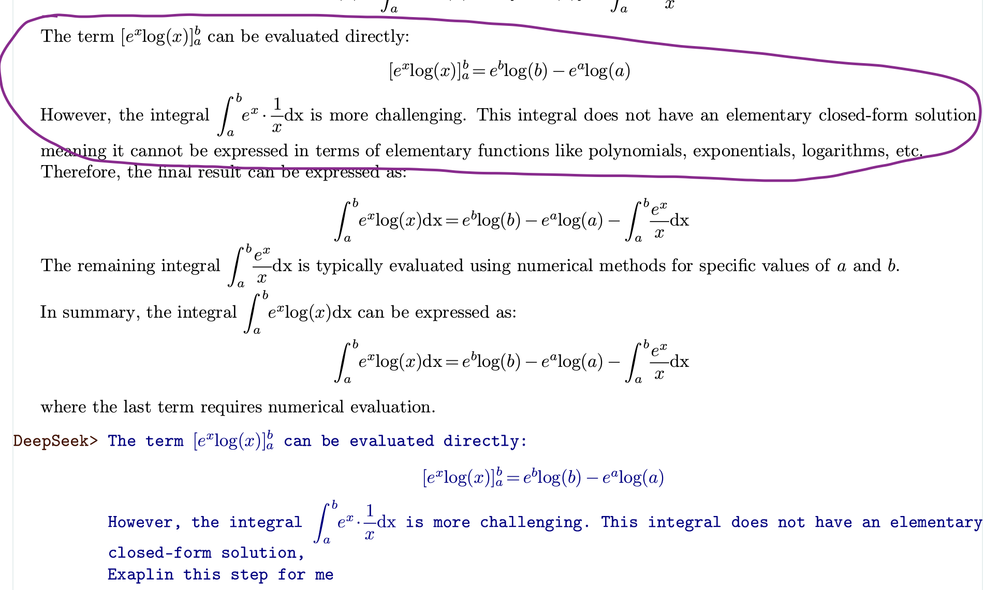
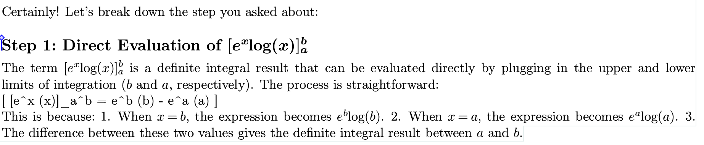

# AI大模型集成插件

Mogan并不支持大模型集成。然而我们开发的半开源的[Liii STEM](https://liiistem.cn/)内置了大模型插件。

具体使用可以参考[Liii STEM的AI集成功能](https://liiistem.cn/guide/tutorials/llm_plugin.html)的文档。

## 使用指南

您可以遵循下图插入一个大模型的 Session

### 直接用渲染的数学公式作为输入

我们支持直接使用Liii STEM的编辑和渲染方式作为大模型的输入，输入将被自动转换为$\LaTeX$和`Markdown`格式。如下图所示：

### 可编辑的大模型输出

一个常见的在使用大模型的时候的问题就是对模型的回答进行整理归档以及进一步提问。 Liii STEM 原生支持对模型的输出进行编辑，且这个编辑和Liii STEM的编辑方式完全相同。您甚至可以直接进行内容的复制粘贴，他都将以Liii STEM的渲染方式进行渲染。如下图所示：

### 直接粘贴渲染的大模型输出作为下一个问题的输入！

很多时候，大模型给出的答案会有一些小的错误或者模糊的回答，想要在下一个问题中精准定位这个部分需要用户对`markdown` 和 $\LaTeX$ 的语法有基础的认识。 而且往往需要用户手动将大模型的输出转为`markdown`格式并且进行细微编辑后重新粘贴进去。如下图所示:

但是上述一切麻烦在Liii STEM 中不复存在！您可以直接粘贴大模型的答案并直接问他问题！我们的软件会讲一切上述流程自动化为您进行！如下图所示：

此功能不仅支持数学公式，甚至支持表格，如下图所示

## FAQ

Q: 可以使用中文问答吗？
A：可以，需要先将文档语言设置为中文。