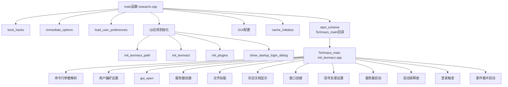

# Mogan Research 启动流程分析


## 概述

Mogan Research（原名TeXmacs）是一个基于Scheme语言和Qt框架的科学文档编辑系统,本文档详细分析其启动流程。

### 核心文件
- **`src/Mogan/Research/research.cpp`** - 程序主入口，`main()`函数所在
- **`src/System/Boot/init_texmacs.cpp`** - TeXmacs核心初始化，`TeXmacs_main()`函数所在

---

## 1. src/Mogan/Research/research.cpp - 程序主入口

### 1.1 文件结构
```cpp
research.cpp
├── 包含的头文件（第12-58行）
├── 外部变量声明（第60-68行）
├── boot_hacks()函数（第78-103行）
├── immediate_options()函数（第109-163行）
└── main()函数（第167-282行）
```

### 1.2 核心函数分析

#### **boot_hacks()函数**（第78-103行）
```cpp
void boot_hacks() {
#ifdef OS_MACOS
    // macOS文件描述符限制调整
    rlimit lims;
    getrlimit(RLIMIT_NOFILE, &lims);
    lims.rlim_cur = max(lims.rlim_cur, 4096);  // 默认256 → 至少4096
    setrlimit(RLIMIT_NOFILE, &lims);
#ifdef MACOSX_EXTENSIONS
    mac_fix_yosemite_bug();  // 修复Yosemite特定bug
#endif
#endif
}
```

#### **immediate_options()函数**（第109-163行）
处理立即执行的命令行选项：

| 选项 | 功能 |
|------|------|
| `-S` / `-setup` | 重置设置，删除缓存和字体错误文件 |
| `-delete-cache` | 删除所有缓存文件 |
| `-delete-style-cache` | 删除样式缓存（`__*`模式） |
| `-delete-font-cache` | 删除字体缓存 |
| `-delete-plugin-cache` | 删除插件缓存 |
| `-delete-server-data` | 删除服务器数据 |
| `-delete-databases` | 删除数据库 |
| `-headless` | 启用无头模式（`headless_mode = true`） |
| `-d` / `-debug` | 禁用日志记录 |

#### **main()函数**（第167-282行） - 核心启动流程

**阶段1：系统初始化**（第169-189行）
```cpp
lolly::init_tbox();                    // 初始化tbox库
lolly::system::args a(argc, argv);     // 参数包装
// 栈大小调整（如果定义了STACK_SIZE）
original_path = get_env("PATH");      // 保存原始PATH
boot_hacks();                         // 平台hack
windows_delayed_refresh(1000000000);  // Windows刷新延迟
immediate_options(argc, argv);        // 命令行参数处理
```

**阶段2：用户偏好和主题设置**（第190-225行）
```cpp
load_user_preferences();              // 加载用户偏好
string theme = get_user_preference("gui theme", "default");
// 主题映射逻辑：
// - macOS非arm64: default → ""
// - 其他平台: default → "liii"
// 设置tm_style_sheet路径
// 环境变量设置：
// - LC_NUMERIC="POSIX"（非Windows）
// - QT_QPA_PLATFORM="xcb"（非macOS）
// - XDG_SESSION_TYPE="x11"（非macOS）
```

**阶段3：Qt应用初始化**（第226-251行） - **commit 3122d5f关键修改**
```cpp
#ifdef QTTEXMACS
// DPI缩放策略设置（Qt 5.14+）
#if QT_VERSION >= QT_VERSION_CHECK(5, 14, 0)
#if defined(Q_OS_WIN)
    QGuiApplication::setHighDpiScaleFactorRoundingPolicy(
        Qt::HighDpiScaleFactorRoundingPolicy::RoundPreferFloor);
#else
    QGuiApplication::setHighDpiScaleFactorRoundingPolicy(
        Qt::HighDpiScaleFactorRoundingPolicy::PassThrough);
#endif
#endif

// Qt应用对象创建
if (headless_mode)
    qtmcoreapp = new QTMCoreApplication(argc, argv);
else
    qtmapp = new QTMApplication(argc, argv);

// 核心初始化（commit 3122d5f调整了顺序）
init_texmacs_path(argc, argv);
init_texmacs();
init_plugins();                       // 从TeXmacs_main移到此处

// 新增：启动登录对话框检查
if (!show_startup_login_dialog()) {
    // 用户拒绝对话框，清理退出
    if (headless_mode) delete qtmcoreapp;
    else delete qtmapp;
    return 1;                         // 非正常退出
}
#endif
```

**阶段4：GUI配置和Scheme启动**（第252-281行）
```cpp
#ifdef QTTEXMACS
if (!headless_mode) {
    qtmapp->set_window_icon("/misc/images/stem-512.png");
    init_style_sheet(qtmapp);

    // 截图工具和全局热键设置（Ctrl+Alt+X）
    ScreenshotTool* screenshotTool = new ScreenshotTool(nullptr);
    if (QHotkey::isPlatformSupported()) {
        QHotkey* hotkey = new QHotkey(QKeySequence("Ctrl+Alt+X"), true, qtmapp);
        QObject::connect(hotkey, &QHotkey::activated, qApp, [screenshotTool]() {
            screenshotTool->startCapture();
        });
    }
}
#endif

// 核心数据结构初始化
the_et = tuple();
the_et->data = ip_observer(path());
cache_initialize();

// 启动Scheme系统，传递TeXmacs_main作为入口
start_scheme(argc, argv, TeXmacs_main);

// 清理Qt资源
#ifdef QTTEXMACS
if (headless_mode) delete qtmcoreapp;
else delete qtmapp;
#endif
return 0;
```

---

## 2. src/System/Boot/init_texmacs.cpp - TeXmacs核心初始化

### 2.1 文件结构
```
init_texmacs.cpp
├── 包含的头文件（第12-53行）
├── 外部变量声明（第59-82行）
├── 工具函数区（第84-567行）
│   ├── clean_exit_on_segfault() 段错误处理
│   ├── init_texmacs_path()      路径初始化
│   ├── init_texmacs()           主初始化
│   ├── init_plugins()           插件初始化
│   ├── load_welcome_doc()       欢迎文档
│   └── 各种辅助函数
└── TeXmacs_main()函数（第570-914行）
```

### 2.2 核心函数分析

#### **init_texmacs_path()函数**（第99-196行）
**功能**: 设置`TEXMACS_PATH`环境变量

| 平台 | 路径规则 |
|------|----------|
| **Linux** | `../share/PREFIX_DIR` |
| **macOS** | `../Resources/share/PREFIX_DIR`（Bundle环境） |
| **Windows** | `..`（相对路径） |
| **WASM** | `/TeXmacs` |

**关键检查**: 确保`TEXMACS_PATH`存在，否则程序退出。

#### **init_texmacs()函数**（第513-533行）
```cpp
void init_texmacs() {
    init_main_paths();      // 主路径设置（TEXMACS_HOME_PATH）
    init_user_dirs();       // 创建用户目录结构（35+个目录）
    acquire_boot_lock();    // 获取启动锁，防止重复启动
    init_succession_status_table();  // 初始化状态表
    init_std_drd();         // 初始化标准DRD（文档关系定义）
    load_user_preferences(); // 加载用户偏好（再次）
    init_scheme();          // Scheme路径设置（GUILE_LOAD_PATH）
    init_env_vars();        // 环境变量设置（PATH、样式路径等）
    init_misc();            // 杂项初始化
}
```

#### **init_plugins()函数**（第547-567行） - **关键状态检测**
```cpp
void init_plugins() {
    url settings_path = "$TEXMACS_HOME_PATH/system/settings.scm";

    install_status = 0;  // 默认：正常启动

    if (exists(settings_path)) {
        // 正常启动，加载现有设置
        string s = string_load(settings_path);
        texmacs_settings = block_to_scheme_tree(s);
    } else {
        setup_texmacs();    // 首次安装
        install_status = 1; // 首次安装状态
    }

    if (get_setting("VERSION") != XMACS_VERSION) {
        init_upgrade();     // 版本升级处理
        install_status = 2; // 版本更新状态
    }

    setup_tex();            // TeX设置
    init_tex();             // TeX初始化
}
```

**install_status 状态说明**:
- **0**: 正常启动（设置文件存在且版本匹配）
- **1**: 首次安装（设置文件不存在）
- **2**: 版本更新（设置文件版本不匹配）

#### **TeXmacs_main()函数**（第570-914行） - **GUI主循环**

**阶段A：命令行参数解析**（第571-783行）
处理30+种命令行选项：

| 类别 | 选项示例 | 功能 |
|------|----------|------|
| **调试选项** | `-debug-events`、`-debug-io`、`-debug-qt` | 启用特定调试输出 |
| **功能选项** | `-convert`、`-execute`、`-server` | 文件转换、执行命令、启动服务器 |
| **信息选项** | `-version`、`-path`、`-help` | 显示版本、路径、帮助信息 |
| **显示选项** | `-retina`、`-geometry`、`-font` | 视网膜显示、窗口几何、字体设置 |
| **模式选项** | `-headless`、`-silent` | 无头模式、静默模式 |

**阶段B：用户偏好和应用设置**（第784-824行）
- 视网膜显示配置（环境变量`TEXMACS_RETINA`、`TEXMACS_RETINA_ICONS`）
- 菜单栏/工具栏偏好（原生菜单栏、统一工具栏、迷你条）
- 主题相关设置

**阶段C：GUI启动和文件加载**（第825-875行）
```cpp
gui_open(argc, argv);                 // 打开GUI系统
set_default_font(the_default_font);   // 设置默认字体
server sv(app_type::RESEARCH);        // 创建服务器实例

// 加载命令行指定的文件
for (i = 1; i < argc; i++) {
    if (argv[i][0] != '-' && argv[i][0] != '+') {
        url u = url_system(argv[i]);
        string cmd = "(load-buffer " + scm_quote(as_string(u)) + ")";
        exec_delayed(scheme_cmd(cmd));  // 延迟执行Scheme命令
    }
}
```

**阶段D：欢迎文档和窗口创建**（第867-874行）
```cpp
if (install_status == 1 || install_status == 2) {
    load_welcome_doc();  // 首次安装或更新显示欢迎文档
}
if (number_buffers() == 0) {
    open_window();       // 创建"no name"缓冲区窗口
}
```

**阶段E：事件循环启动**（第876-913行） - **commit 3122d5f关键修改**
```cpp
texmacs_started = true;
if (!disable_error_recovery)
    signal(SIGSEGV, clean_exit_on_segfault);  // 段错误处理
if (start_server_flag)
    server_start();                           // 启动服务器
release_boot_lock();                          // 释放启动锁

#ifdef QTTEXMACS
// 新增：登录触发逻辑（在事件循环启动后执行）
if (g_startup_login_requested) {
    QTimer::singleShot(0, []() {
        if (is_server_started()) {
            tm_server_rep* server = dynamic_cast<tm_server_rep*>(
                get_server().operator->());
            if (server && server->getAccount()) {
                server->getAccount()->login();  // 执行登录
            }
        }
        g_startup_login_requested = false;  // 清除标志
    });
}
#endif

if (N(extra_init_cmd) > 0)
    exec_delayed(scheme_cmd(extra_init_cmd));  // 执行额外命令
gui_start_loop();        // 启动GUI事件循环（阻塞）

gui_close();             // 关闭GUI
```

#### **show_startup_login_dialog()函数**（第916-953行） - **commit 3122d5f新增**
```cpp
bool show_startup_login_dialog() {
    // 条件检查（全部满足才显示对话框）
    if (headless_mode) {
        return true;  // 无头模式不显示
    }
    if (install_status != 1 && install_status != 2) {
        return true;  // 非安装状态不显示
    }
    if (is_community_stem()) {
        return true;  // 社区版不显示
    }

    // 显示对话框
    QWK::StartupLoginDialog dialog;
    auto result = dialog.execWithResult();

    switch (result) {
    case QWK::StartupLoginDialog::LoginClicked:
        g_startup_login_requested = true;  // 设置全局标志
        cout << "TeXmacs] Startup login dialog: Login requested\n";
        return true;
    case QWK::StartupLoginDialog::SkipClicked:
        cout << "TeXmacs] Startup login dialog: Skip clicked\n";
        return true;  // 继续启动
    case QWK::StartupLoginDialog::DialogRejected:
        cout << "TeXmacs] Startup login dialog: Dialog rejected\n";
        return false; // 退出程序
    }
    return true;
}
```

---

## 3. commit 3122d5f 改动详细分析

### 3.1 改动文件列表
```
修改文件（6个）：
1. TeXmacs/plugins/lang/dic/en_US/zh_CN.scm    # 词典更新
2. devel/201_46.md                            # 功能说明文档
3. src/Mogan/Research/research.cpp             # 主入口
4. src/Plugins/Qt/startup_login_dialog.cpp     # 新增：登录对话框实现
5. src/Plugins/Qt/startup_login_dialog.hpp     # 新增：对话框头文件
6. src/System/Boot/init_texmacs.cpp            # 核心初始化
```

### 3.2 关键修改点

#### **1. 初始化顺序调整**（research.cpp:243）
```diff
// 修改前：在show_startup_login_dialog()之后调用init_plugins()
// 修改后：将init_plugins()移到对话框之前调用
+ init_plugins();  // 必须先调用以确定install_status
// 才能正确判断是否显示对话框
```

**原因**：`show_startup_login_dialog()`函数需要检查`install_status`变量，而该变量在`init_plugins()`函数中设置。

#### **2. 新增全局标志**（init_texmacs.cpp:69）
```cpp
bool g_startup_login_requested = false;
```

#### **3. 新增函数声明**（init_texmacs.cpp:79）
```cpp
bool show_startup_login_dialog();
```

#### **4. 对话框检查逻辑**（research.cpp:245-250）
```cpp
// 新增：启动登录对话框检查
if (!show_startup_login_dialog()) {
    // 用户拒绝对话框，清理退出
    if (headless_mode) delete qtmcoreapp;
    else delete qtmapp;
    return 1;  // 非正常退出
}
```

#### **5. 异步登录触发**（init_texmacs.cpp:887-902）
```cpp
// 在事件循环启动后异步执行登录
if (g_startup_login_requested) {
    QTimer::singleShot(0, []() {
        if (is_server_started()) {
            tm_server_rep* server = dynamic_cast<tm_server_rep*>(
                get_server().operator->());
            if (server && server->getAccount()) {
                server->getAccount()->login();
            }
        }
        g_startup_login_requested = false;
    });
}
```


### 3.3 条件触发机制
对话框仅在以下条件**同时满足**时显示：

1. **非headless模式**（`headless_mode == false`）
2. **安装状态为1或2**（`install_status == 1 || install_status == 2`）
   - `1`: 首次安装（无settings.scm）
   - `2`: 版本更新（VERSION不匹配）
3. **非社区版本**（`is_community_stem() == false`）

### 3.4 函数调用位置澄清

#### **show_startup_login_dialog()调用位置**
**重要澄清**：`show_startup_login_dialog()` 函数**不在** `TeXmacs_main` 中调用，而是在 `main()` 函数中调用。

**实际调用位置**：`src/Mogan/Research/research.cpp:245-250`
```cpp
// Show startup login dialog
if (!show_startup_login_dialog ()) {
    // User rejected dialog, clean up and exit
    if (headless_mode) delete qtmcoreapp;
    else delete qtmapp;
    return 1;
}
```

**函数定义位置**：`src/System/Boot/init_texmacs.cpp:916-953`

#### **调用关系图**
```
main() 函数 (research.cpp)
├── Qt应用初始化
├── init_texmacs_path()
├── init_texmacs()
├── init_plugins()
├── show_startup_login_dialog() ← 这里调用
│   └── 可能设置 g_startup_login_requested = true
├── GUI配置
├── start_scheme(argc, argv, TeXmacs_main) ← 启动Scheme
│   └── TeXmacs_main() 被回调执行
│       ├── GUI系统启动
│       ├── 事件循环准备
│       ├── 登录触发检查 ← 如果 g_startup_login_requested == true
│       └── gui_start_loop()
└── 程序退出
```

#### **TeXmacs_main中的相关逻辑**
虽然 `show_startup_login_dialog()` 不在 `TeXmacs_main` 中调用，但 `TeXmacs_main` 会处理**登录触发**：
```cpp
// src/System/Boot/init_texmacs.cpp:887-902
// 在事件循环启动后异步执行登录
if (g_startup_login_requested) {
    QTimer::singleShot(0, []() {
        if (is_server_started()) {
            tm_server_rep* server = dynamic_cast<tm_server_rep*>(
                get_server().operator->());
            if (server && server->getAccount()) {
                server->getAccount()->login();
            }
        }
        g_startup_login_requested = false;
    });
}
```

#### **设计分离的原因**
1. **职责分离**：
   - `show_startup_login_dialog()`：**条件检查**和**用户交互**（早期决策）
   - `TeXmacs_main`：**业务逻辑执行**（后期执行）

2. **启动流程阶段**：
   ```
   阶段4: 用户引导（main函数中）← 早期决策
     └── show_startup_login_dialog()

   阶段12: 登录触发（TeXmacs_main中）← 后期执行
     └── 异步登录执行
   ```

3. **错误处理差异**：
   - 对话框拒绝 → **立即退出**（`return 1`）
   - 登录触发失败 → **继续运行**（不影响主程序）

4. **性能优化**：
   - 早期决策可以阻止不必要的资源初始化
   - 登录操作在正确的GUI上下文中执行

---

## 4. 完整启动流程

### 4.1 调用关系图


### 4.2 详细时序
```
阶段 0: 程序启动
  ├── main()函数执行

阶段 1: 系统级初始化
  ├── lolly::init_tbox() - tbox库初始化
  ├── boot_hacks() - 平台特定hack（macOS文件描述符）
  ├── immediate_options() - 命令行参数处理
  ├── load_user_preferences() - 用户偏好加载

阶段 2: Qt框架初始化
  ├── QTMApplication/QTMCoreApplication创建
  ├── 高DPI设置（Qt 5.14+）

阶段 3: 核心初始化
  ├── init_texmacs_path() - 设置TEXMACS_PATH
  ├── init_texmacs() - 主初始化（目录、环境变量）
  ├── init_plugins() - 插件初始化（关键：设置install_status）

阶段 4: 用户引导（commit 3122d5f新增）
  ├── show_startup_login_dialog() - 条件检查
  │   ├── 条件1: 非headless模式 ❌→跳过
  │   ├── 条件2: install_status==1或2 ❌→跳过
  │   ├── 条件3: 非社区版本 ❌→跳过
  │   └── 全部通过 → 显示对话框
  ├── 对话框结果处理:
  │   ├── LoginClicked → g_startup_login_requested=true
  │   ├── SkipClicked → 继续启动
  │   └── DialogRejected → 返回1，程序退出

阶段 5: GUI配置
  ├── 设置窗口图标（stem-512.png）
  ├── 初始化样式表
  ├── 截图工具和热键设置（Ctrl+Alt+X）

阶段 6: Scheme系统启动
  ├── the_et初始化
  ├── cache_initialize()
  ├── start_scheme(argc, argv, TeXmacs_main)

阶段 7: TeXmacs_main接管（init_texmacs.cpp）
  ├── 详细命令行参数解析（30+选项）
  ├── 调试标志设置
  ├── 视网膜显示配置
  ├── 用户偏好应用（菜单栏、工具栏）

阶段 8: GUI系统启动
  ├── gui_open() - 打开GUI
  ├── set_default_font() - 设置默认字体
  ├── server创建 - app_type::RESEARCH

阶段 9: 文件处理
  ├── 加载命令行指定的文件
  ├── exec_delayed() - 延迟执行Scheme命令

阶段 10: 欢迎和窗口
  ├── 条件：install_status==1或2 → load_welcome_doc()
  ├── 条件：无缓冲区 → open_window()

阶段 11: 事件循环准备
  ├── 信号处理设置（SIGSEGV）
  ├── 条件：start_server_flag → server_start()
  ├── release_boot_lock() - 释放启动锁

阶段 12: 登录触发（commit 3122d5f新增）
  ├── 条件：g_startup_login_requested==true
  ├── QTimer::singleShot(0, 登录逻辑)
  ├── 登录逻辑：获取服务器→获取账户→login()

阶段 13: 事件循环启动
  ├── 条件：extra_init_cmd非空 → exec_delayed()
  ├── gui_start_loop() - 进入主循环（阻塞）

阶段 14: 程序退出
  ├── gui_close() - 关闭GUI
  ├── Qt资源清理
  └── 返回0
```

---

## 5. 关键设计模式分析

### 5.1 分层初始化架构
```
操作系统层
    ├── lolly::init_tbox()
    └── boot_hacks()

运行时库层
    ├── Qt框架初始化
    └── 环境变量设置

框架层
    ├── init_texmacs() - 核心初始化
    ├── init_plugins() - 插件系统
    └── start_scheme() - Scheme运行时

应用层
    ├── TeXmacs_main() - 业务逻辑
    ├── GUI系统
    └── 服务器架构

用户引导层（commit 3122d5f新增）
    └── show_startup_login_dialog() - 条件触发引导
```

### 5.2 状态驱动设计
```cpp
// 核心状态变量
bool headless_mode;           // 无头模式标志
int install_status;           // 安装状态：0正常/1首次/2更新
bool g_startup_login_requested; // 登录请求标志

// 状态转换
init_plugins() → 设置install_status
show_startup_login_dialog() → 检查install_status
登录触发 → 检查g_startup_login_requested
```

### 5.3 平台抽象
**路径处理抽象**：
```cpp
// init_texmacs_path()中的平台分支
#ifdef OS_GNU_LINUX
    // Linux路径规则
#elif defined(OS_MACOS)
    // macOS Bundle路径
#elif defined(OS_WIN) || defined(OS_MINGW)
    // Windows路径规则
#elif defined(OS_WASM)
    // WASM路径规则
#endif
```

**GUI抽象层**：
```cpp
gui_open()      // 打开GUI（平台实现）
gui_start_loop() // 启动事件循环
gui_close()     // 关闭GUI
```

### 5.4 延迟执行模式
```cpp
// 1. 命令行参数延迟执行
exec_delayed(scheme_cmd("(load-buffer ...)"));

// 2. 登录延迟执行（commit 3122d5f）
QTimer::singleShot(0, []() { /* 登录逻辑 */ });

// 3. 欢迎文档延迟加载
exec_delayed(scheme_cmd("(mogan-welcome)"));

// 4. 额外命令延迟执行
exec_delayed(scheme_cmd(extra_init_cmd));
```

### 5.5 条件编译和配置
```cpp
// 功能开关
#ifdef QTTEXMACS           // Qt GUI支持
#ifdef IS_COMMUNITY        // 社区版/商业版
#ifdef USE_MUPDF_RENDERER  // PDF渲染器选择
#ifdef HEADLESS_MODE       // 无头模式支持

// 平台检测
#ifdef OS_MACOS
#ifdef OS_GNU_LINUX
#ifdef OS_WIN
#ifdef OS_WASM
```

---

## 6. 错误处理和健壮性设计

### 6.1 启动锁机制
```cpp
// init_texmacs.cpp:340-357
void acquire_boot_lock() {
    url lock_file = "$TEXMACS_HOME_PATH/system/boot_lock";
    if (exists(lock_file)) {
        // 检测到重复启动，清理状态
        remove(url("$TEXMACS_HOME_PATH/system/settings.scm"));
        remove(get_tm_cache_path() * url_wildcard("*"));
        remove(url("$TEXMACS_HOME_PATH/fonts/error") * url_wildcard("*"));
    }
    save_string(lock_file, "", false);  // 创建锁文件
}

void release_boot_lock() {
    url lock_file = "$TEXMACS_HOME_PATH/system/boot_lock";
    remove(lock_file);  // 正常退出时删除锁
}
```

### 6.2 段错误处理
```cpp
// init_texmacs.cpp:88-93
void clean_exit_on_segfault(int sig_num) {
    (void) sig_num;
    cerr << lolly::get_stacktrace() << LF;  // 输出堆栈跟踪
    TM_FAILED("segmentation fault");        // 标记失败
}
```

### 6.3 路径验证
```cpp
// init_texmacs.cpp:188-195
current_texmacs_path = get_env("TEXMACS_PATH");
if (is_empty(current_texmacs_path) ||
    !exists(url_system(current_texmacs_path))) {
    cout << "The required TEXMACS_PATH(" << current_texmacs_path
         << ") does not exists" << LF;
    exit(1);  // 关键路径不存在，直接退出
}
```

### 6.4 用户目录创建
创建35+个用户目录，确保文件系统结构完整：
```cpp
// init_user_dirs()函数创建目录示例
make_dir("$TEXMACS_HOME_PATH");
make_dir("$TEXMACS_HOME_PATH/bin");
make_dir("$TEXMACS_HOME_PATH/doc");
make_dir("$TEXMACS_HOME_PATH/fonts");
// ... 更多目录
```

---

**文档版本**: 1.0
**分析时间**: 2025-12-31
**文件位置**: `src/Mogan/Research/research.cpp`, `src/System/Boot/init_texmacs.cpp`